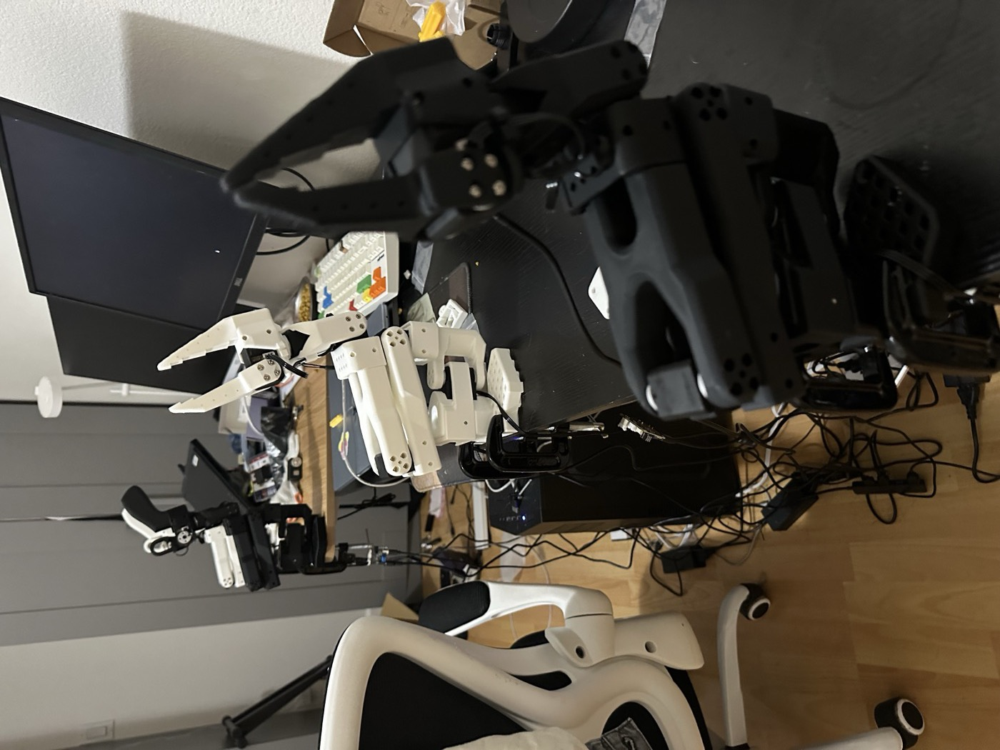
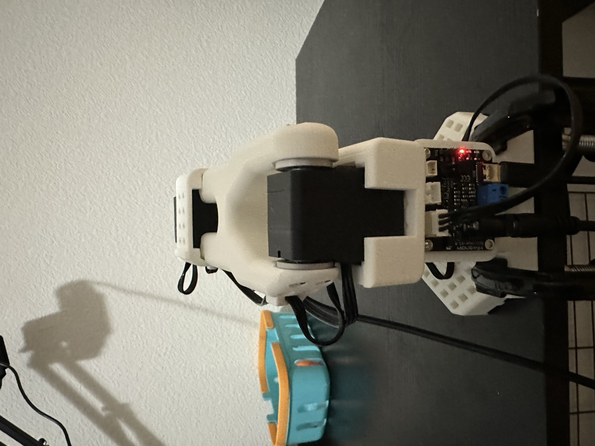
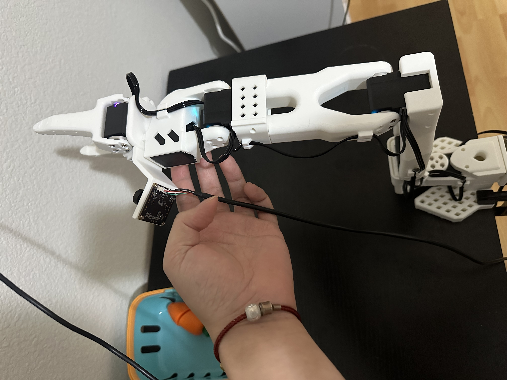
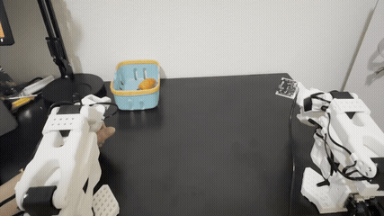
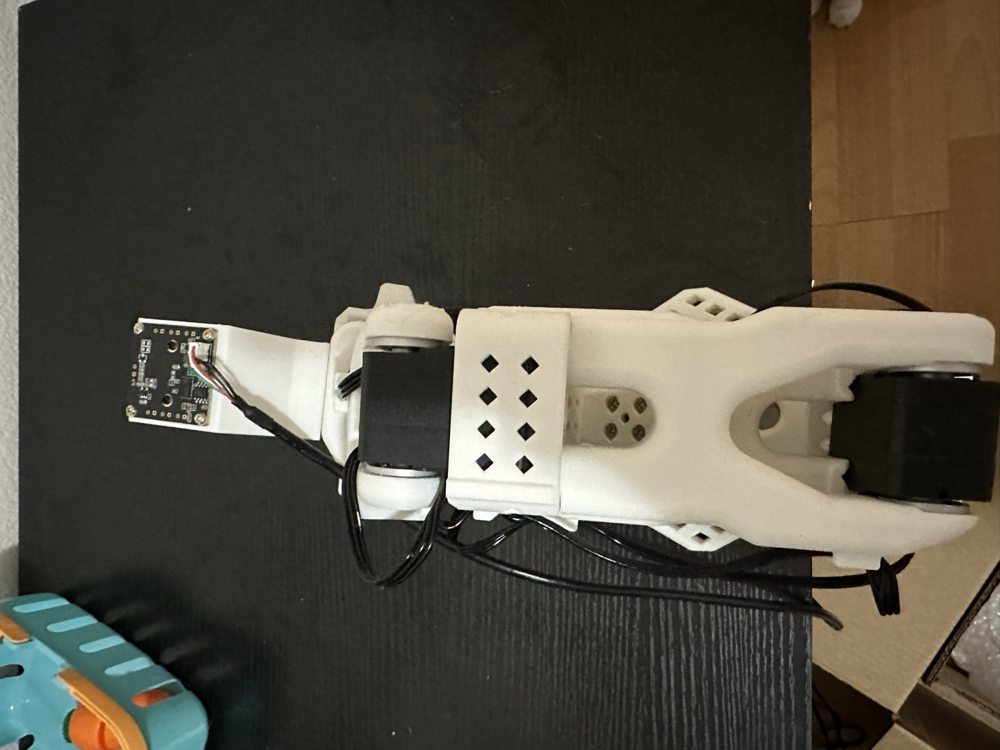
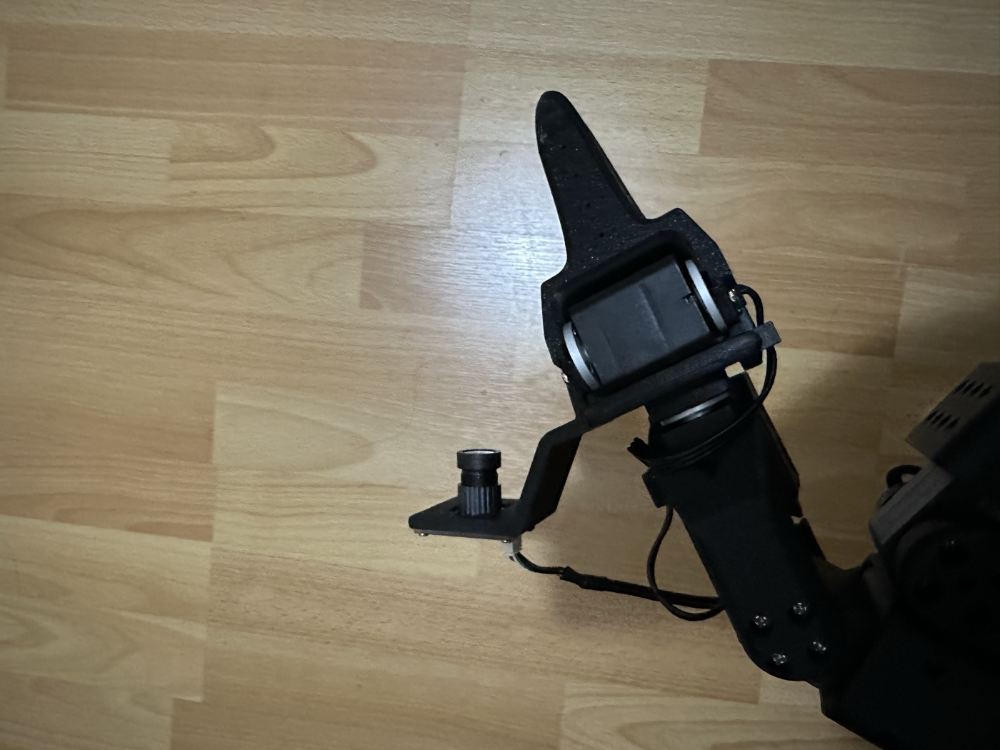
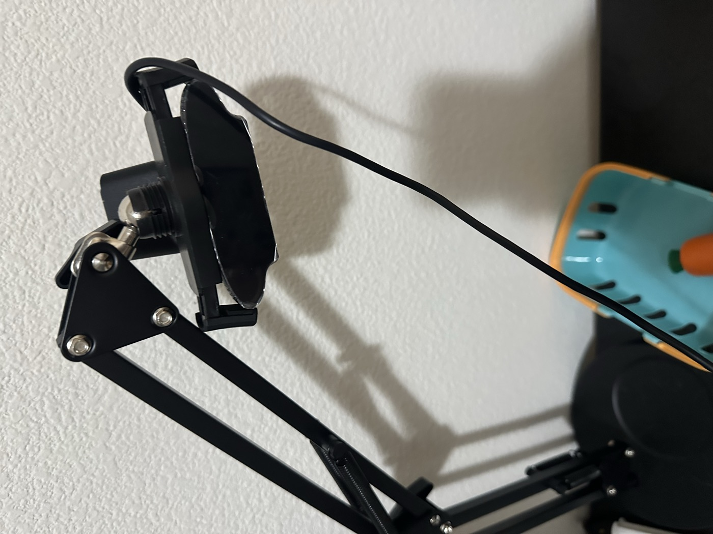
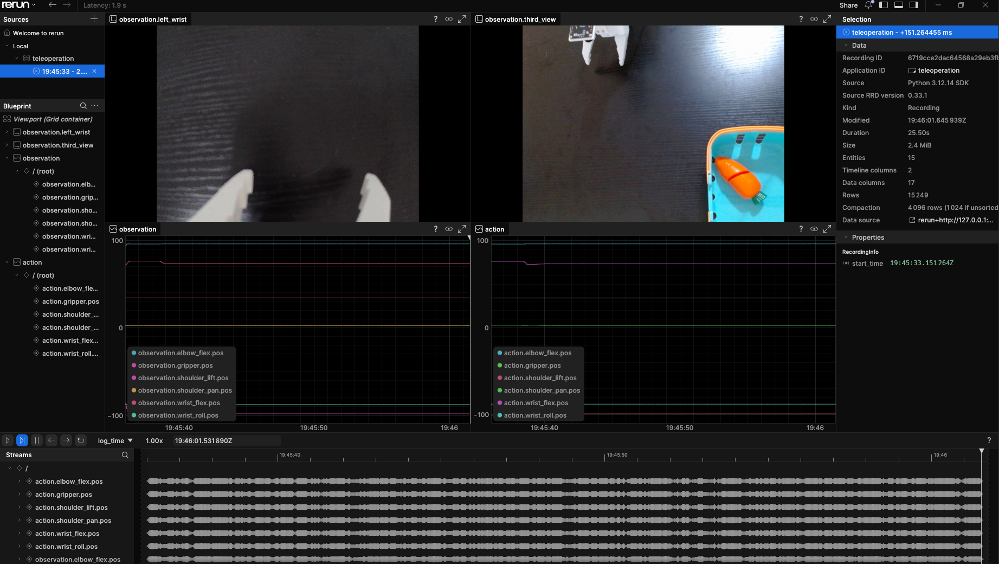
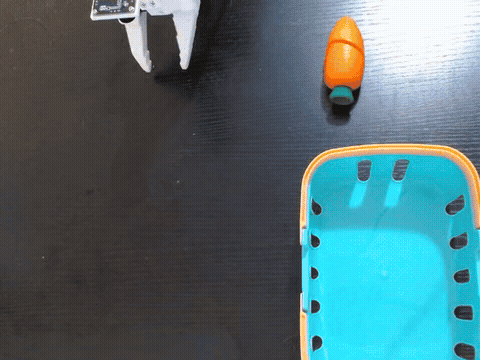
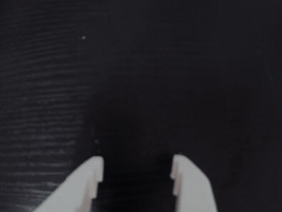

I have been building a small robot learning pipeline around the SO-101, starting from hardware assembly and calibration and moving toward data collection, training, and inference.

This post is the first part of that process. It focuses on getting the hardware working reliably for teleoperation, bringing up the camera stack, and collecting an initial dataset. Later posts will cover training and inference on top of the same setup.

## Hardware Build

The hardware setup uses two pairs of leader and follower SO-101 arms. I printed the main SO-101 parts on a Bambu P1S using the [updated MakerWorld SO-101 model](https://makerworld.com/en/models/1399268-lerobot-so-101-arms-_-updated#profileId-1450759), and used the [32x32 UVC wrist camera mount](https://github.com/TheRobotStudio/SO-ARM100/tree/main/Optional/Wrist_Cam_Mount_32x32_UVC_Module) for the gripper camera setup. After printing, I assembled the arms, inserted the servos into the printed structure, and connected the electronics, cameras, and control stack.

The software side follows the LeRobot workflow and is aimed at a full robot learning loop: teleoperation, synchronized multi-view recording, dataset construction, training, and later policy inference.

  <figure>
    
    <figcaption>Figure 1. Two pairs of SO-101 leader-follower arms after the initial hardware build.</figcaption>
  </figure>
  <figure>
    
    <figcaption>Figure 2. One assembled SO-101 arm mounted on the desk after the initial setup.</figcaption>
  </figure>

The mechanical build was straightforward overall, but a few steps were more physical than expected. Some printed parts required substantial force to seat the servos fully, and a screwdriver was helpful when reconnecting wires after the arm was fully assembled. Careful cable routing also mattered more than I initially expected, especially once multiple servos and two full arm pairs were connected at the same time.

Once the parts were assembled, I assigned motor IDs after installation, following the order from `6` down to `1`. Doing this methodically made later calibration and debugging much easier. I also ran into two motors that behaved unexpectedly during bring-up, so isolating and reassigning their IDs was useful for getting the system back into a stable state.

The first commands I used at this stage were:

  
Show setup commands

  <pre><code>lerobot-find-port
sudo chmod 666 /dev/ttyACM*
lerobot-setup-motors \
  --teleop.type=so101_leader \
  --teleop.port=/dev/ttyACM1</code></pre>

## Calibration

I first calibrated one leader arm and one follower arm and verified that single-pair teleoperation worked correctly. After that, I installed the second pair and repeated the process for dual-arm teleoperation.

The main issue I ran into was calibration inconsistency. In some cases, the servo state at the middle position would incorrectly appear as a minimum or maximum value. When that happened, the calibrated range drifted away from the real physical range, and the follower arm could move only within a reduced range, for example with the gripper no longer closing fully. In practice, the most useful fixes were unplugging and reconnecting power before recalibrating, checking whether another cable or servo connection was interfering with the reading, and verifying the affected joint carefully, especially around `servo6`.

Once the calibration state was clean, both the single-arm and dual-arm teleoperation setup behaved much more reliably.

The photo below shows one of the calibration checks I used, with the servos aligned around their middle positions before validating the joint ranges.

<figure class="article-figure-small">
  
  <figcaption>Figure 3. Calibration check with the servos aligned around their middle positions.</figcaption>
</figure>

The main calibration commands were:

  
Show calibration commands

  <pre><code>lerobot-calibrate --teleop.type=so101_leader --teleop.port=/dev/ttyACM0 --teleop.id=xi_awesome_bimanual_leader_left
lerobot-calibrate --teleop.type=so101_leader --teleop.port=/dev/ttyACM1 --teleop.id=xi_awesome_bimanual_leader_right
lerobot-calibrate --robot.type=so101_follower --robot.port=/dev/ttyACM2 --robot.id=xi_awesome_bimanual_follower_left
lerobot-calibrate --robot.type=so101_follower --robot.port=/dev/ttyACM3 --robot.id=xi_awesome_bimanual_follower_right</code></pre>

## Teleoperation

The short teleoperation clip below shows the main goal of this stage: making the follower track the leader reliably enough to support later recording and training.

<figure class="article-figure-tele">
  
  <figcaption>Figure 7. A short teleoperation clip showing the follower arm moving with the leader arm.</figcaption>
</figure>

To support teleoperation and recording, I installed one camera for the left arm, one camera for the right arm, and one third-view camera for the overall scene.

  <figure>
    
    <figcaption>Figure 4. Left-arm camera setup.</figcaption>
  </figure>
  <figure>
    
    <figcaption>Figure 5. Right-arm camera setup.</figcaption>
  </figure>
  <figure>
    
    <figcaption>Figure 6. Third-view camera setup.</figcaption>
  </figure>

Teleoperation itself worked before the vision stack was fully stable, but initially the images did not render correctly. The issue turned out to be on the graphics side rather than in the teleoperation logic. After installing the required graphics driver and rerunning the pipeline, the visualization started working as expected.

I first brought up teleoperation in a single-arm configuration, then moved to the two-arm setup once the camera streams and calibration were stable. The exact `/dev/ttyACM*` and `/dev/video*` assignments changed across runs, so the commands below are representative snippets rather than fixed device mappings.

  
Show single-arm teleoperation command

  <pre><code>lerobot-teleoperate \
  --robot.type=so101_follower \
  --robot.port=/dev/ttyACM1 \
  --robot.id=xi_awesome_bimanual_follower_left \
  --robot.cameras='{
    "left_wrist": {
      "type": "opencv",
      "index_or_path": "/dev/video0",
      "width": 640,
      "height": 480,
      "fps": 30,
      "fourcc": "MJPG",
      "rotation": 0
    },
    "third_view": {
      "type": "opencv",
      "index_or_path": "/dev/video4",
      "width": 640,
      "height": 480,
      "fps": 30,
      "fourcc": "MJPG",
      "rotation": 0
    }
  }' \
  --teleop.type=so101_leader \
  --teleop.port=/dev/ttyACM0 \
  --teleop.id=xi_awesome_bimanual_leader_left \
  --display_data=true</code></pre>

  
Show two-arm teleoperation command

  <pre><code>lerobot-teleoperate \
  --robot.type=bi_so_follower \
  --robot.left_arm_config.port=/dev/ttyACM2 \
  --robot.right_arm_config.port=/dev/ttyACM3 \
  --robot.id=xi_awesome_bimanual_follower \
  --robot.left_arm_config.cameras='{
    "left_wrist": {
      "type": "opencv",
      "index_or_path": "/dev/video0",
      "width": 640,
      "height": 480,
      "fps": 30,
      "fourcc": "MJPG",
      "rotation": 0
    }
  }' \
  --robot.right_arm_config.cameras='{
    "right_wrist": {
      "type": "opencv",
      "index_or_path": "/dev/video2",
      "width": 640,
      "height": 480,
      "fps": 30,
      "fourcc": "MJPG",
      "rotation": 0
    }
  }' \
  --robot.cameras='{
    "third_view": {
      "type": "opencv",
      "index_or_path": "/dev/video4",
      "width": 640,
      "height": 480,
      "fps": 30,
      "fourcc": "MJPG",
      "rotation": 0
    }
  }' \
  --teleop.type=bi_so_leader \
  --teleop.left_arm_config.port=/dev/ttyACM0 \
  --teleop.right_arm_config.port=/dev/ttyACM1 \
  --teleop.id=xi_awesome_bimanual_leader \
  --display_data=true</code></pre>

One practical issue I ran into during teleoperation was that a motor would occasionally fail to respond after startup. In my case, the quickest fix was to unplug the power, manually move the servo slightly, and then reconnect power before relaunching teleoperation.

For inspection and debugging, I used the `rerun` interface to monitor teleoperation streams, observations, and action traces.

<figure class="article-figure-wide">
  
  <figcaption>Figure 8. Teleoperation and inspection in rerun, including wrist-view, third-view, observations, and action traces.</figcaption>
</figure>

This part of the setup was a useful reminder that robot learning pipelines are often bottlenecked by system integration details rather than the model itself.

## Data Collection

With the hardware and cameras in place, I moved on to a first round of data collection built around a simple task: picking up a carrot prop and placing it into a box.

The resulting dataset is [`Franc1sF/carrot-52`](https://huggingface.co/datasets/Franc1sF/carrot-52), which contains `52` episodes of this carrot-to-box task. At this stage, the goal was not task difficulty itself, but validating the full recording loop: teleoperation, multi-view recording, reproducible episode capture, and a dataset format that could later support training and evaluation.

I started with the main recording workflow:

  
Show recording command

  <pre><code>lerobot-record \
  --robot.type=so101_follower \
  --robot.port=/dev/ttyACM1 \
  --robot.id=xi_awesome_bimanual_follower_left \
  --robot.cameras='{
    "left_wrist": {
      "type": "opencv",
      "index_or_path": "/dev/video0",
      "width": 640,
      "height": 480,
      "fps": 30,
      "fourcc": "MJPG",
      "rotation": 0
    },
    "third_view": {
      "type": "opencv",
      "index_or_path": "/dev/video4",
      "width": 640,
      "height": 480,
      "fps": 30,
      "fourcc": "MJPG",
      "rotation": 0
    }
  }' \
  --teleop.type=so101_leader \
  --teleop.port=/dev/ttyACM0 \
  --teleop.id=xi_awesome_bimanual_leader_left \
  --display_data=true \
  --dataset.repo_id="${HF_USER}/record-test" \
  --dataset.num_episodes=50 \
  --dataset.single_task="Grab carrot and place in the box" \
  --dataset.push_to_hub=true \
  --dataset.episode_time_s=30 \
  --dataset.reset_time_s=30</code></pre>

During recording, I mostly relied on three simple keyboard controls: the left arrow key canceled the current episode, the right arrow key saved it early, and `Esc` exited the recording loop once I had collected enough data or wanted to pause and continue later.

For continuing a partial recording session locally, I used:

  
Show resume-recording command

  <pre><code>lerobot-record \
  --robot.type=so101_follower \
  --robot.port=/dev/ttyACM1 \
  --robot.id=xi_awesome_bimanual_follower_left \
  --robot.cameras='{
    "left_wrist": {
      "type": "opencv",
      "index_or_path": "/dev/video0",
      "width": 640,
      "height": 480,
      "fps": 30,
      "fourcc": "MJPG",
      "rotation": 0
    },
    "third_view": {
      "type": "opencv",
      "index_or_path": "/dev/video4",
      "width": 640,
      "height": 480,
      "fps": 30,
      "fourcc": "MJPG",
      "rotation": 0
    }
  }' \
  --teleop.type=so101_leader \
  --teleop.port=/dev/ttyACM0 \
  --teleop.id=xi_awesome_bimanual_leader_left \
  --dataset.repo_id="$DATASET_ID" \
  --dataset.root="$DATASET_ROOT" \
  --dataset.num_episodes=39 \
  --dataset.single_task="Grab carrot and place in the box" \
  --dataset.episode_time_s=30 \
  --dataset.reset_time_s=30 \
  --dataset.push_to_hub=false \
  --display_data=false \
  --resume=true</code></pre>

Below is one example episode shown through the third-view and left-wrist streams, which I used to quickly inspect whether the captured data looked usable.

  <figure>
    
    <figcaption>Figure 9. Dataset example from the third-view camera.</figcaption>
  </figure>
  <figure>
    
    <figcaption>Figure 10. Dataset example from the left-wrist camera.</figcaption>
  </figure>

After a quick review pass, I uploaded the dataset to Hugging Face by converting the recorded episodes into parquet files in the LeRobot v3.0 format. The full dataset, including additional views and clips, is available on [Hugging Face](https://huggingface.co/datasets/Franc1sF/carrot-52).

For replay and spot checking, I used:

  
Show replay command

  <pre><code>lerobot-replay \
  --robot.type=so101_follower \
  --robot.port=/dev/ttyACM1 \
  --robot.id=xi_awesome_bimanual_follower_left \
  --dataset.repo_id=Franc1sF/record-test_20260902_135156 \
  --dataset.root=/home/f/.cache/huggingface/lerobot/Franc1sF/record-test_20260902_135156 \
  --dataset.episode=0</code></pre>

<figure class="article-figure-small">
  <video controls playsinline preload="metadata" poster="replay-poster.jpg">
    <source src="replay-preview-trimmed.mp4" type="video/mp4">
  </video>
  <figcaption>Figure 11. A short replay clip from the recorded dataset and inspection workflow.</figcaption>
</figure>

## What I Learned

The main lesson from this first build cycle was that reliability matters before scale. Before thinking about policy quality, model size, or sim-to-real transfer, the hardware and data pipeline need to behave consistently. A small calibration error, unstable camera setup, or recording bug can easily dominate everything downstream. That was exactly the point of starting with a simple carrot-to-box task: it was easy enough to execute repeatedly, but still sufficient to reveal whether teleoperation, sensing, recording, and replay were actually working together as a system.

The next stage is to move from this validated data loop into training and inference: using the recorded demonstrations to train a policy, testing rollout behavior, and then iterating on both the task setup and the data quality. I am especially interested in how far this setup can go toward sim-to-real transfer, lightweight post-training, and more efficient policy improvement. I expect the more interesting lessons to come from that stage, especially around how much data is actually needed, what failures appear first during inference, and how simulation and real-world execution should be combined.

## References

1. [Seeed Studio: LeRobot SO-101 setup](https://wiki.seeedstudio.com/cn/lerobot_so100m_new/)
2. [Seeed Studio: LeRobot double-arm training workflow](https://wiki.seeedstudio.com/cn/lerobot_double_arm_so_arm_training/)
3. [MakerWorld: updated SO-101 arm model](https://makerworld.com/en/models/1399268-lerobot-so-101-arms-_-updated#profileId-1450759)
4. [SO-ARM100 optional wrist camera mount](https://github.com/TheRobotStudio/SO-ARM100/tree/main/Optional/Wrist_Cam_Mount_32x32_UVC_Module)
5. [Hugging Face LeRobot SO-101 documentation](https://huggingface.co/docs/lerobot/en/so101)
