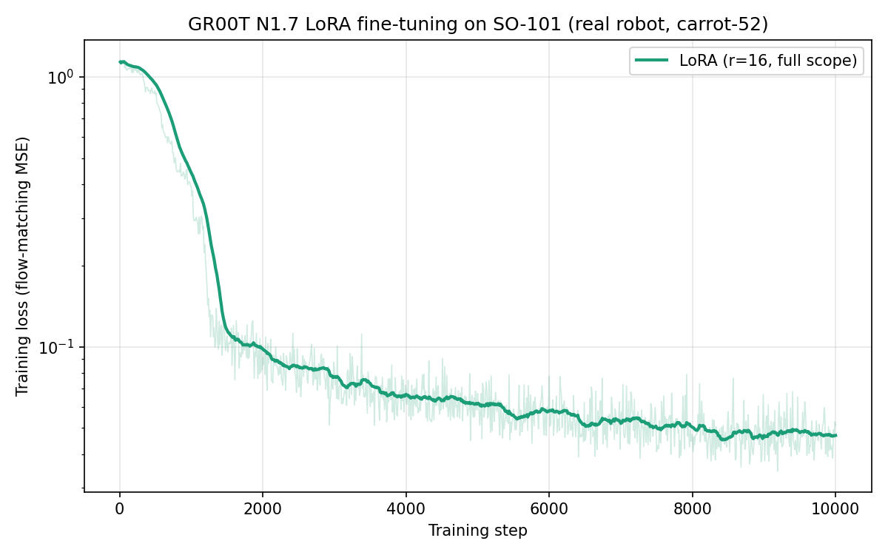

The recorded SO-101 trajectories become useful only after their cameras, state, and action meanings are made legible to the VLA.

[Part I](/blog/building-a-dual-arm-so-101-pipeline/) established the physical loop: leader-follower teleoperation, camera bring-up, and a carrot-to-box dataset. This part carries that dataset into a GR00T N1.7 post-training run. The purpose is not to claim a general SO-101 policy from 52 demonstrations. It is to establish the next link in the pipeline: a validated path from recorded trajectories to a model that can be trained on their visual and action interface.

The broader LoRA-family analysis—why a GR00T projector needs a custom adapter, and how LoRA, QLoRA, and DoRA compare on LIBERO—is in [VLA Post-Training Part I](/blog/vla-post-training-lora-family/). This note focuses on the SO-101-specific work.

## What the Model Receives

The `Franc1sF/carrot-52` dataset contains 52 teleoperated carrot-to-box episodes, 27,209 frames, a fixed third-person camera, and a wrist camera. The action/state schema is six-dimensional:

\[
q=(q_{\mathrm{shoulder\ pan}},q_{\mathrm{shoulder\ lift}},q_{\mathrm{elbow}},q_{\mathrm{wrist\ flex}},q_{\mathrm{wrist\ roll}},q_{\mathrm{gripper}}).
\]

This order already matched the available SO-101 modality definition. The camera keys did not. The recordings used `observation.images.third_view` and `observation.images.left_wrist`, while the GR00T configuration expects abstract `front` and `wrist` roles. The mapping below was chosen after decoding and checking the two camera streams: the third view sees the workspace, while the wrist view looks between the gripper fingers.

  
Show the SO-101 camera mapping

  <pre><code>{
  "video": {
    "front": {"original_key": "observation.images.third_view"},
    "wrist": {"original_key": "observation.images.left_wrist"}
  }
}</code></pre>

This mapping is not a cosmetic rename. It determines which visual role is associated with each video stream during training and later inference. A mismatched camera role can make an apparently valid dataset semantically wrong for the policy.

## From LeRobot Dataset to GR00T Input

The dataset was recorded in the LeRobot v3.0 layout, which stores multi-episode parquet and video assets together. The GR00T data loader used for this run expected LeRobot v2.1 path templates with one episode per file. It therefore could not read the v3.0 paths directly. The upstream v3-to-v2 conversion utility was used before fine-tuning.

This is the first post-training lesson from the hardware pipeline: data compatibility has two layers. A dataset must be syntactically readable, but it must also preserve the intended camera, state, and action semantics. Converting a file layout addresses only the first layer.

The SO-101 is registered as GR00T's `new_embodiment` rather than receiving a dedicated pretrained category. In the generic checkpoint, the selected category-specific projector slice is an untrained initialization. The full-scope LoRA setup therefore learns a compact embodiment map for this target while adapting shared action and visual-language layers. The details of that custom projector adapter are discussed in [VLA Post-Training Part I](/blog/vla-post-training-lora-family/#what-lora-must-reach-in-gr00t).

## The Fine-Tuning Configuration

The run uses a rank-16 full-scope LoRA configuration. “Full scope” means the action-DiT, visual-language self-attention, and the category-specific state/action projector are adapted; visual-language layer normalization remains trainable. This matters more than the label “LoRA” alone, because a DiT-only adapter would leave the target embodiment interface unchanged.

| Setting | Value |
| --- | --- |
| Base model | GR00T N1.7-3B generic checkpoint |
| Dataset | `Franc1sF/carrot-52`: 52 episodes, one task, two cameras |
| Optimization | 10,000 steps; cosine schedule; 5% warmup; learning rate 1e-4 |
| Batch | Global batch 32: 8 per GPU across four GPUs |
| Adapter | Rank 16; alpha 32; dropout 0.05; full scope |
| Data loading | Two workers |

  
Show the LoRA launch arguments

  <pre><code>--use_action_lora \
--action_lora_scope full \
--action_lora_rank 16 \
--action_lora_alpha 32 \
--action_lora_dropout 0.05</code></pre>

The two-worker setting is intentional. Higher worker counts caused host-memory pressure in this small video dataset. This is a useful operational distinction: PEFT reduces the trainable-model and optimizer footprint, but it does not remove host memory consumed by video decoding, sharding, and prefetching.

## What the Training Curve Establishes

<figure class="article-figure-wide">
  
  <figcaption>Figure 1. Trainer-reported loss for the SO-101 carrot-to-box fine-tuning run, ending near 0.039.</figcaption>
</figure>

The final trainer-reported average loss was 0.0391. This confirms that the full path—dataset conversion, modality mapping, embodiment configuration, custom adapter, and flow-matching training—optimizes on the recorded distribution.

It does <em>not</em> establish closed-loop robot success. There is no held-out split, no physical rollout success-rate evaluation, and no test of recovery after a missed grasp or a changed object pose. With 52 examples of one workspace and one task, low training loss is only an in-distribution fit signal.

<figure class="article-figure-wide">
  <video controls playsinline preload="metadata">
    <source src="so101_carrot52_demo_episode0.mp4" type="video/mp4">
  </video>
  <figcaption>Figure 2. A third-person teleoperation episode from carrot-52. It is a training demonstration, not a generated rollout.</figcaption>
</figure>

The appropriate next evaluation is a repeated closed-loop protocol: fixed initial configurations, a defined success criterion, multiple trials, and separate reporting for grasp, placement, and full-task completion. Only that experiment can test whether the trained policy connects its low loss to useful physical behavior.

## Toward Deployment

The remaining step is to turn this training artifact into a control system. Part III will focus on deployment: the SO-101 control process on a Raspberry Pi 5, model inference on a Windows 4090 workstation through WSL2/Ubuntu, and the timing and communication path that joins camera observations, action-chunk inference, and follower-arm commands.

## References

1. NVIDIA, J. Bjorck, F. Castañeda, N. Cherniadev, X. Da, R. Ding, et al. [*GR00T N1: An Open Foundation Model for Generalist Humanoid Robots*](https://arxiv.org/abs/2503.14734). arXiv:2503.14734, 2025.
2. Hugging Face. [*LeRobot SO-101 Documentation*](https://huggingface.co/docs/lerobot/en/so101). Accessed September 2026.
