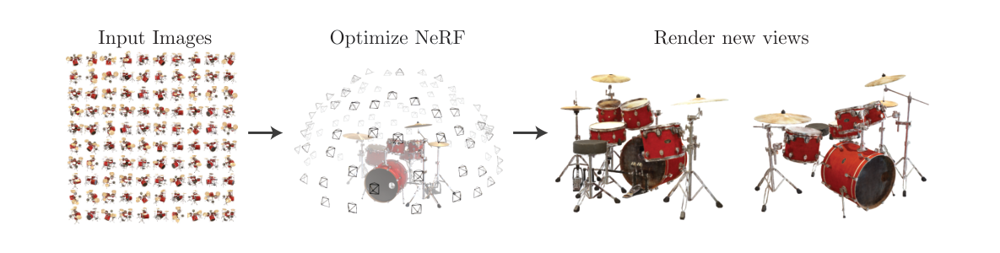
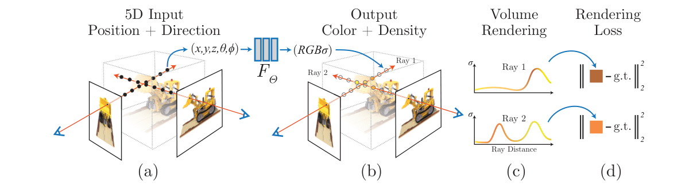
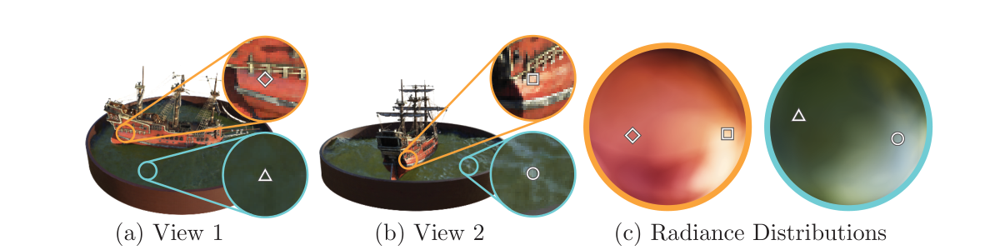

A NeRF does not predict one pixel from one image. It represents a scene, then renders that scene along a camera ray.

[Part I](/blog/implicit-neural-representations/) introduced a neural field as a continuous function queried at a coordinate. A neural radiance field, or NeRF, makes that idea useful for novel-view synthesis: given posed photographs of one static scene, it learns a field that can render what the scene should look like from a new camera position [1].

The central question is simple but precise. A camera pixel corresponds to a 3D ray. Along that ray, where is matter, how much light reaches the camera from each location, and how do those contributions combine into one RGB value? This note develops the answer in that order.

<figure class="article-figure-wide">
  
  <figcaption>Figure 1. The high-level NeRF objective: posed input images optimize one continuous scene representation, which can render unseen views. Reproduced from [1, Fig. 1].</figcaption>
</figure>

## The Input Is a Set of Posed Images

NeRF is not trained from unstructured photographs alone. For every training image, it needs a calibrated camera: intrinsics determine which ray leaves each pixel, and extrinsics place that ray in a common world coordinate system. The camera model is developed in [Multi-View Geometry · Part I](/blog/multi-view-geometry-camera-models/).

For a pixel, let <em>o</em> be the camera center and let <em>d</em> be its unit viewing direction in world coordinates. Points on its ray are

\[
\mathbf r(t)=\mathbf o+t\mathbf d,
\qquad t\in[t_n,t_f].
\]

The scalar <em>t</em> is distance along the ray. The bounds <em>t</em>n and <em>t</em>f limit rendering to the portion of space that may contain the scene. Thus, camera calibration gives the query locations; the neural field supplies the scene properties at those locations.

If camera poses are inaccurate, rays from different images no longer meet at the same 3D structures. The field can then compensate by becoming blurry or geometrically inconsistent. NeRF therefore inherits a basic multi-view requirement: pose quality is part of the representation problem, not merely preprocessing.

## What a Radiance Field Returns

The original NeRF represents a scene with a function

\[
f_\theta(\mathbf x,\mathbf d)
\longrightarrow
\bigl(\sigma(\mathbf x),\mathbf c(\mathbf x,\mathbf d)\bigr).
\]

Here <em>x</em> ∈ ℝ3 is a 3D position, <em>d</em> is a unit viewing direction, <em>σ</em>(<em>x</em>) ≥ 0 is volume density, and <em>c</em>(<em>x</em>, <em>d</em>) ∈ ℝ3 is RGB radiance traveling toward the camera. The distinction between these outputs is essential.

Density is view-independent. The field uses the same density at one 3D point regardless of the observing camera. It is the part that can become a geometric proxy: large density makes a ray likely to terminate nearby.

Color may be view-dependent. A glossy highlight changes as the observer moves even when the surface point does not. Conditioning RGB on <em>d</em> lets NeRF model this effect. It does not mean that the physical surface itself changes with the camera.

The original architecture reflects this split. A position-encoded MLP first maps <em>x</em> to density and a learned feature vector. The viewing direction joins only in a later color head. Part I's positional encoding is used for both position and direction because raw MLP inputs tend to fit low-frequency content first.

<figure class="article-figure-wide">
  
  <figcaption>Figure 2. The full NeRF pipeline: samples and directions enter the field, volume rendering produces pixels, and RGB residuals supervise the representation. Reproduced from [1, Fig. 2].</figcaption>
</figure>

The paper makes view-dependent appearance visible on the Ship scene. The two marked locations receive different colors as the viewing direction changes, yielding two smooth directional radiance distributions. This is the capability that lets a radiance field reproduce non-Lambertian appearance rather than assigning one fixed RGB value to every 3D location.

<figure class="article-figure-wide">
  
  <figcaption>Figure 3. A view-dependent appearance analysis from NeRF: two locations on a ship have radiance that changes continuously with viewing direction. Reproduced from [1, Fig. 3].</figcaption>
</figure>

## Why a Ray Needs Volume Rendering

A surface model would identify one ray-surface intersection and shade it. NeRF instead represents a continuous volume. A ray can pass through empty space, semi-transparent material, thin geometry, or several partially occluding regions. The rendered color must combine all of these possibilities.

At distance <em>t</em>, define the transmittance from the camera to that point as

\[
T(t)=\exp\!\left(-\int_{t_n}^{t}\sigma(\mathbf r(s))\,ds\right).
\]

The integral accumulates density before <em>t</em>. High accumulated density makes <em>T</em>(<em>t</em>) small, meaning little light from farther along the ray reaches the camera. The continuous rendering equation is

\[
\hat{\mathbf C}(\mathbf r)=
\int_{t_n}^{t_f}
T(t)\,\sigma(\mathbf r(t))\,
\mathbf c(\mathbf r(t),\mathbf d)\,dt.
\]

Each factor has a distinct job: <em>T</em>(<em>t</em>) says that the ray survived to the point, <em>σ</em> says how much the point contributes, and <em>c</em> supplies its color. The hat on <em>C</em> marks this as the model's rendered prediction, rather than an observed pixel.

## A Useful Analogy: Tomographic Reconstruction

The inverse problem has the same broad shape as transmission CT. In both cases, measurements are made along many known rays and are used to infer a continuous field inside a volume. The analogy is useful as long as the forward models are kept distinct.

In idealized X-ray CT, let μ(<em>x</em>) be the attenuation coefficient at position <em>x</em>. A ray measurement obeys the Beer-Lambert model

\[
I(\mathbf r)=I_0\exp\!\left(
-\int_{t_n}^{t_f}\mu(\mathbf r(t))\,dt
\right),
\]

where <em>I</em>0 is incident intensity and <em>I</em>(<em>r</em>) is the detected intensity. Taking the negative log converts the measurement to a line integral:

\[
p(\mathbf r)=
-\log\!\left(\frac{I(\mathbf r)}{I_0}\right)=
\int_{t_n}^{t_f}\mu(\mathbf r(t))\,dt.
\]

The collection of such projections is the Radon-transform setting underlying classical tomographic reconstruction [2]. NeRF also queries an unknown field along rays, but its measurement is a color formed by emission and absorption, not a log-linear attenuation projection.

| Aspect | Transmission CT | NeRF |
| --- | --- | --- |
| Unknown field | Attenuation μ(<em>x</em>) | Density σ(<em>x</em>) and directional color <em>c</em>(<em>x</em>, <em>d</em>) |
| Measurement on a ray | One transmitted intensity, usually log-transformed into a line integral | One RGB value produced by alpha compositing along the ray |
| Forward model | ∫ μ(<em>r</em>(<em>t</em>)) d<em>t</em> | ∫ <em>T</em>(<em>t</em>)σ(<em>r</em>(<em>t</em>))<em>c</em>(<em>r</em>(<em>t</em>), <em>d</em>) d<em>t</em> |
| Reconstruction | Analytic inversion is available under ideal sampling assumptions; iterative methods address nonideal data | A per-scene MLP is optimized through the nonlinear rendering equation |
| Interpretation | μ has a physical attenuation meaning | σ is primarily an appearance-supported density; it is not automatically a quantitative material property |

The important shared intuition is many rays constrain one common volume. A point cannot independently explain every observation: its value must agree with the rays passing through it from different views. The important difference is occlusion and direction-dependent appearance. NeRF's transmittance makes nearer density suppress farther color, and its color field changes with viewing direction. Therefore it does not admit the simple filtered-backprojection route associated with ideal CT; it is learned by differentiating the rendering model against observed pixels.

## From the Integral to a Computable Pixel

The integral cannot be evaluated exactly because the field is a neural network. NeRF samples <em>N</em> ordered distances

\[
t_n < t_1 < t_2 < \cdots < t_N < t_f.
\]

The distance between adjacent samples is

\[
\delta_i=t_{i+1}-t_i.
\]

The field is queried at <em>x</em>i = <em>r</em>(<em>t</em>i). Let σi and <em>c</em>i be the predicted density and color there. The probability of stopping within the small interval following sample <em>i</em> is approximated by

\[
\alpha_i=1-\exp(-\sigma_i\delta_i).
\]

The discrete transmittance before sample <em>i</em> is

\[
T_i=\prod_{j=1}^{i-1}(1-\alpha_j),
\qquad T_1=1.
\]

Its rendering weight is then

\[
w_i=T_i\alpha_i.
\]

Finally, the predicted pixel is the weighted sum

\[
\hat{\mathbf C}(\mathbf r)=
\sum_{i=1}^{N}w_i\mathbf c_i.
\]

The weights are useful beyond rendering. A large <em>w</em>i identifies the segment most responsible for that pixel; if all weights remain small, the ray is largely transparent. When a background color <em>c</em>bg is modeled, the remaining transmittance can be added as <em>T</em>N+1<em>c</em>bg. This is why the weights are often described as an approximate distribution over where a ray terminates.

## Training Uses Only Rendering Error

For every observed training pixel, the camera provides its ray and the image provides target color <em>C</em>(<em>r</em>). NeRF renders the same ray and minimizes a photometric loss:

\[
\mathcal L_{\mathrm{rgb}}=
\sum_{\mathbf r\in\mathcal R}
\left\lVert
\hat{\mathbf C}_\theta(\mathbf r)-
\mathbf C(\mathbf r)
\right\rVert_2^2.
\]

The set <em>R</em> contains sampled rays from posed training images. Gradients pass through the discrete volume-rendering computation and update the MLP parameters <em>θ</em>. There is no depth map, mesh, segmentation, or voxel target in the original objective. Multi-view color consistency is the supervision that constrains both density and color.

This also explains a limitation. Matching pixels does not uniquely determine a physically correct scene in every region. Unseen surfaces, reflective materials, and weakly observed geometry can admit several explanations with similar rendered training images. A NeRF's density is an appearance-supported volumetric representation, not automatically a metrically accurate mesh.

## Coarse-to-Fine Sampling Is an Allocation Strategy

Uniformly placing many samples on every ray is wasteful: most points may lie in empty space. Original NeRF uses two networks during training.

1. A coarse network evaluates stratified samples roughly uniformly along the ray and produces weights <em>w</em>ic.
2. Those weights define an importance distribution: intervals with high coarse weight receive more samples.
3. A fine network evaluates the union of coarse and resampled positions to make the final render.

Both renders receive the RGB supervision:

\[
\mathcal L=
\sum_{\mathbf r\in\mathcal R}
\left[
\left\lVert\hat{\mathbf C}_{\mathrm c}(\mathbf r)-\mathbf C(\mathbf r)\right\rVert_2^2+
\left\lVert\hat{\mathbf C}_{\mathrm f}(\mathbf r)-\mathbf C(\mathbf r)\right\rVert_2^2
\right].
\]

Hierarchical sampling does not change the scene model. It changes where computation is spent: more MLP queries near likely matter, fewer in empty space. That distinction is important when later methods accelerate NeRF; they may modify sampling, the field representation, or the renderer, and these are different interventions.

## What NeRF Represents—and What It Does Not

NeRF is especially strong at novel-view synthesis of a static, well-observed scene. It produces convincing images because it jointly explains viewpoints rather than copying one input image. Its representation also gives derived quantities, for example expected ray depth

\[
\hat D(\mathbf r)=\sum_{i=1}^{N}w_i t_i.
\]

However, this depth is derived from the learned density and rendering weights; it is not direct depth supervision. Likewise, extracting a mesh requires choosing a density threshold and sampling the field, much as Part I sampled an occupancy or signed-distance field before Marching Cubes. The result can be useful, but it should not be confused with an explicit surface model learned under geometric supervision.

The original formulation also assumes a static scene, known camera poses, enough view coverage, and substantial per-scene optimization. Rendering is expensive because each pixel requires many field queries. These limitations motivate later work on faster encodings and renderers, sparse-view priors, dynamic fields, and explicit radiance primitives.

## The Story in Five Steps

1. A calibrated pixel defines a world-space ray.
2. A neural field predicts density at positions on that ray and color for each viewing direction.
3. Transmittance makes nearer dense regions occlude farther contributions.
4. Differentiable volume rendering turns all ray samples into a predicted RGB pixel.
5. Photometric error across posed images trains one continuous, scene-specific representation.

Part I asked what it means to represent an image, shape, or scene as a function. Part II adds the rendering operator that lets one such function explain many images of one scene. The next question is practical: how can a radiance-field representation be made fast enough to train and render efficiently?

## References

1. B. Mildenhall, P. P. Srinivasan, M. Tancik, J. T. Barron, R. Ramamoorthi, and R. Ng. [*NeRF: Representing Scenes as Neural Radiance Fields for View Synthesis*](https://www.ecva.net/papers/eccv_2020/papers_ECCV/papers/123460392.pdf). ECCV, 2020.
2. A. C. Kak and M. Slaney. [*Principles of Computerized Tomographic Imaging*](https://slaney.org/pct/pct-toc.html). IEEE Press, 1988; SIAM, 2001.
