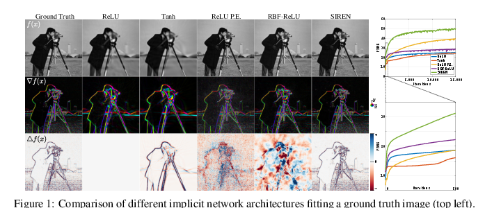

A neural network can be a representation to query, not only a predictor to run once.

An image is usually stored as a grid of pixels. A mesh is stored as vertices and faces. A voxel scene is stored as values on a 3D grid. These are all discrete representations: they tell us what is stored at particular locations, then rely on interpolation, rasterization, or meshing when we need something in between.

An implicit neural representation, also called a neural field, takes the opposite view. Instead of storing the values directly, it stores the parameters of a function that can be queried at any continuous coordinate [1]. An image, a shape, and a scene then become different choices of domain and output.

This note develops that idea before NeRF. The important question is not yet how to render a new view. It is: what does it mean to represent visual data by a function?

## From an Array to a Function

For a color image, a pixel grid stores RGB values at integer coordinates. A neural image representation instead learns a function

\[
f_\theta:\mathbb R^2\rightarrow\mathbb R^3,
\qquad
(u,v)\mapsto(r,g,b).
\]

The input is a continuous 2D coordinate. The output is a color. The weights <em>θ</em> of an MLP are now the representation of this particular image. Asking for a pixel at a new coordinate simply means evaluating the network there.

The same pattern extends to 3D. Let <em>x</em> be a point in space:

\[
\mathbf{x}=(x,y,z)^{\mathsf T}\in\mathbb R^3.
\]

The choice of output determines what field is represented. A scalar can describe geometry; a color can describe appearance; a vector can describe flow or surface normals. This coordinate-to-property form is the common core of neural fields [1].

Continuous does not mean that information appears from nowhere. The function is fitted from finite observations and has finite capacity. It can be sampled at arbitrary resolution, but it cannot recover texture or geometry that the data and model never constrained.

## Training a Field from Samples

Suppose we observe samples

\[
\mathcal D=\{(\mathbf{x}_i,\mathbf{y}_i)\}_{i=1}^{N},
\]

where <em>x</em>i is a coordinate and <em>y</em>i is the observed property at that coordinate. For image fitting, <em>y</em>i is RGB. For a signed-distance field, it is a distance value. The most basic objective is

\[
\min_\theta
\sum_{i=1}^{N}
\left\lVert f_\theta(\mathbf{x}_i)-\mathbf{y}_i\right\rVert_2^2.
\]

This is deliberately ordinary supervised learning. The change is in what the network represents. A conventional vision network maps an image to one label or pose. Here, the network maps each coordinate to a local property, and the whole function describes the object.

After fitting, a query is cheap to write down:

\[
\mathbf{y}=f_\theta(\mathbf{x}).
\]

It may not be cheap to evaluate millions of times. That distinction matters later: neural fields trade storage regularity and differentiability for many MLP evaluations.

## “Implicit” Has a Precise Geometric Meaning

The word *implicit* is often used loosely. Here it does not mean an implicit optimization layer or an energy-based model. It means that a surface is specified by a condition on a function rather than by an explicit list of triangles.

Let a scalar field be

\[
s_\theta:\mathbb R^3\rightarrow\mathbb R.
\]

Its zero-level set is

\[
\mathcal S=\{\mathbf{x}\in\mathbb R^3\mid s_\theta(\mathbf{x})=0\}.
\]

The equation defines every point on the surface at once. There is no stored vertex list in the representation itself. A mesh can still be extracted later; it is an output format, not the underlying representation.

## Three Fields, Three Questions

The coordinate network is the same outer template, but its output semantics change the task.

| Field | Query | Output | Surface or image meaning |
| --- | --- | --- | --- |
| Occupancy | <em>x</em> in 3D | <em>o</em>θ(<em>x</em>) ∈ [0, 1] | Probability that the point is inside an object; the surface is commonly the threshold boundary. |
| Signed distance | <em>x</em> in 3D | <em>s</em>θ(<em>x</em>) ∈ ℝ | Signed distance to the closest surface; zero is the surface, and sign identifies inside versus outside. |
| Radiance field | position <em>x</em> and view direction <em>d</em> | density and color | What a camera ray accumulates into a pixel; this is the NeRF setting. |

### Occupancy: is this point inside?

An occupancy network learns

\[
o_\theta(\mathbf{x})\approx
\Pr(\mathbf{x}\text{ is inside}\mid\text{observation}).
\]

Its surface can be written as the decision boundary

\[
\mathcal S=\{\mathbf{x}\mid o_\theta(\mathbf{x})=\tau\},
\]

where <em>τ</em> is commonly 0.5. Occupancy Networks [2] made this representation useful for reconstruction because it avoids committing to a coarse voxel grid or a fixed mesh topology.

### SDF: how far, and on which side?

A signed distance function gives more structure:

\[
s(\mathbf{x})=
\begin{cases}
-\operatorname{dist}(\mathbf{x},\mathcal S), & \mathbf{x}\text{ inside},\\
0, & \mathbf{x}\in\mathcal S,\\
+\operatorname{dist}(\mathbf{x},\mathcal S), & \mathbf{x}\text{ outside}.
\end{cases}
\]

Near a well-behaved surface, an exact SDF satisfies

\[
\lVert\nabla s(\mathbf{x})\rVert_2=1.
\]

This gradient points along the surface normal direction. DeepSDF [3] uses a learned continuous SDF for shape representation, interpolation, and completion. The useful difference from occupancy is not just a different loss: the field tells an optimizer which side of the surface it is on and approximately how far away it is.

### Radiance: what reaches the camera?

A radiance field adds appearance and viewing direction:

\[
f_\theta(\mathbf{x},\mathbf{d})
\rightarrow
\bigl(\sigma(\mathbf{x}),\mathbf{c}(\mathbf{x},\mathbf{d})\bigr).
\]

Here <em>σ</em> is volume density and <em>c</em> is view-dependent color. This is not simply a surface classifier. The density and color must be integrated along a camera ray to form a pixel. NeRF [5] is the canonical example; that rendering equation is the subject of Part II.

## A Surface Still Needs to Become a Mesh

The field is continuous, but a graphics engine or geometry tool often needs triangles. The usual bridge is to evaluate the scalar field on a grid and run Marching Cubes [6] to find the iso-surface. For an SDF the chosen level is zero; for occupancy it is the threshold <em>τ</em>.

The order is important:

\[
\text{learned field}
\quad\longrightarrow\quad
\text{sampled grid}
\quad\longrightarrow\quad
\text{mesh extraction}.
\]

The grid is used during extraction, not necessarily stored as the primary representation. Fine details can be queried where needed, though dense evaluation and Marching Cubes can become expensive.

## Why Plain MLPs Miss Fine Detail

A coordinate MLP with ordinary activations tends to learn low-frequency variation before high-frequency variation. In practice this means broad color changes or smooth shape may fit well while sharp edges, thin structures, and high-frequency texture remain blurred. This behavior is often called spectral bias.

One response is to map the coordinates to a richer set of frequencies before the MLP sees them. A common Fourier feature map is

\[
\gamma(\mathbf{x})=
\left[
\sin(2^0\pi\mathbf{x}),\cos(2^0\pi\mathbf{x}),
\ldots,
\sin(2^{K-1}\pi\mathbf{x}),\cos(2^{K-1}\pi\mathbf{x})
\right].
\]

The integer <em>K</em> is the number of frequency bands. The MLP learns (f_\theta(\gamma(\mathbf{x}))), rather than receiving raw coordinates alone. Positional encoding in NeRF is one familiar use of this idea.

SIREN takes a different route: it uses sine activations throughout the network,

\[
\mathbf{h}_{\ell+1}=
\sin\!\left(W_\ell\mathbf{h}_\ell+\mathbf{b}_\ell\right).
\]

Because the derivative of sine is another sinusoid, SIREN can represent both a signal and its derivatives more faithfully when initialized and trained appropriately [4]. Figure 1 compares several implicit-network choices on an image; although all are supervised only with image values, the lower rows reveal how differently they represent the signal's gradient and Laplacian.

<figure class="article-figure-wide">
  
  <figcaption>Figure 1. Fitting an image is not the whole story: different coordinate networks can match pixels yet disagree strongly on derivatives. SIREN is designed to retain high-frequency detail and well-behaved derivatives. Reproduced from [4, Fig. 1].</figcaption>
</figure>

Neither Fourier features nor sine activations create missing evidence. They change the function class and optimization behavior so the model can fit detail that the observations do contain.

## Is the Network One Scene or Many?

There are two easy-to-confuse regimes.

In per-instance fitting, one set of weights represents one image, object, or scene:

\[
\theta_{\mathrm{scene}}
\quad\leftrightarrow\quad
\text{one particular scene}.
\]

This is the original mental model for a NeRF: optimize a field for a specific captured scene.

In conditional or generative fields, one shared network represents many examples and receives an additional latent code:

\[
f_\theta(\mathbf{x},\mathbf{z})\rightarrow y.
\]

The code <em>z</em> may describe which chair, person, or scene is queried. DeepSDF uses this kind of latent shape code [3]. The first regime memorizes a field through its weights; the second learns a family of fields. Both are neural fields, but their data requirements, training procedure, and generalization claims are different.

## The Four Ideas to Keep

1. A neural field maps a continuous coordinate to a property; the network weights or a latent-conditioned network represent the visual object.
2. Occupancy, SDF, and radiance fields share the same coordinate-query pattern but answer different physical or geometric questions.
3. A continuous representation can be sampled anywhere, but finite data and finite network capacity still limit the detail it can recover.
4. High-frequency encodings and periodic activations address a practical difficulty of coordinate MLPs: fitting fine detail and useful derivatives.

The next question is now precise: given a camera ray, how do density and color values from a radiance field turn into one pixel? That is the bridge from implicit geometry to NeRF.

## References

1. Y. Xie, T. Takikawa, S. Saito, O. Litany, S. Yan, N. Khan, F. Tombari, J. Tompkin, V. Sitzmann, and S. Sridhar. [*Neural Fields in Visual Computing and Beyond*](https://arxiv.org/abs/2111.11426). Computer Graphics Forum, 2022.
2. L. Mescheder, M. Oechsle, M. Niemeyer, S. Nowozin, and A. Geiger. [*Occupancy Networks: Learning 3D Reconstruction in Function Space*](https://arxiv.org/abs/1812.03828). CVPR, 2019.
3. J. J. Park, P. Florence, J. Straub, R. Newcombe, and S. Lovegrove. [*DeepSDF: Learning Continuous Signed Distance Functions for Shape Representation*](https://openaccess.thecvf.com/content_CVPR_2019/html/Park_DeepSDF_Learning_Continuous_Signed_Distance_Functions_for_Shape_Representation_CVPR_2019_paper.html). CVPR, 2019.
4. V. Sitzmann, J. N. P. Martel, A. W. Bergman, D. B. Lindell, and G. Wetzstein. [*Implicit Neural Representations with Periodic Activation Functions*](https://arxiv.org/abs/2006.09661). NeurIPS, 2020.
5. B. Mildenhall, P. P. Srinivasan, M. Tancik, J. T. Barron, R. Ramamoorthi, and R. Ng. [*NeRF: Representing Scenes as Neural Radiance Fields for View Synthesis*](https://arxiv.org/abs/2003.08934). ECCV, 2020.
6. W. E. Lorensen and H. E. Cline. *Marching Cubes: A High Resolution 3D Surface Construction Algorithm*. SIGGRAPH, 1987.
