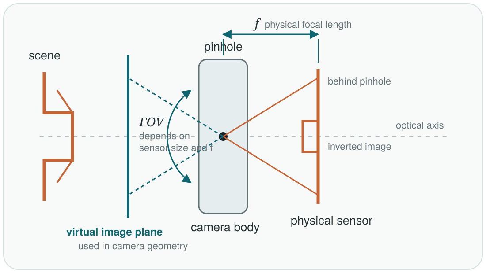

A shadow is a familiar example of projection: a three-dimensional object leaves a two-dimensional pattern on a surface. Its outline may remain recognizable, while depth is lost. A camera performs a more structured version of the same reduction.

In the ideal pinhole model, every visible 3D point defines a ray through one camera center, and the image records where that ray intersects an image plane. This is a central projection; sunlight, by contrast, is often approximated by parallel rays and produces something closer to an orthographic projection.

The camera model can therefore be built as one continuous chain. A point is first described relative to the camera, then projected onto a normalized image plane, and finally expressed in pixel coordinates. The first step is rigid; the second is projective and loses depth; the third only changes units and origin. Following this order keeps the roles of extrinsics and intrinsics distinct.

## Position and Orientation: Extrinsics

The location of a physical point does not change when the coordinate frame changes; only its numerical coordinates do. Let \(X_W\) denote a point in the world frame and \(X_C\) the same point in the camera frame. This article uses the world-to-camera convention

\[
X_C = RX_W+t.
\]

Here, \(R\in SO(3)\) and \(t\in\mathbb{R}^3\) form a rigid change of frame. The camera's position is its center \(C_W\) in world coordinates; its orientation specifies how the camera axes are turned relative to the world. Under this convention, \(R\) encodes the orientation and

\[
t=-RC_W.
\]

Position and orientation therefore determine the translation together: rotating a camera in place leaves \(C_W\) unchanged but changes \(t\). The matrix \([R\mid t]\) maps world coordinates into camera coordinates; it is not the camera-to-world pose. Different libraries adopt different conventions, so this direction should always be stated explicitly. The geometry and key properties of \(SO(3)\) are developed further in [Robot Kinematics, Part I](/blog/robot-kinematics-coordinate-frames-so3-se3/).

## What the Pinhole Keeps and Loses

With the point now expressed in the camera frame, the next question is optical: where does its ray meet the image plane? A physical pinhole camera places the sensor <em>behind</em> the aperture and forms an inverted image. Its focal length \(f\) is the pinhole-to-sensor distance. For geometric derivations, an equivalent virtual image plane is placed in front of the pinhole. It represents the same viewing directions without carrying a sign change or an inverted image through every equation.

<figure class="article-figure-wide">
  
  <figcaption>Figure 1. The physical pinhole camera forms an inverted image on its sensor. For geometry, we use the equivalent virtual plane in front of the pinhole; it makes the normalized coordinates \(x_n=X_C/Z_C\), \(y_n=Y_C/Z_C\) positive in the usual camera axes.</figcaption>
</figure>

The physical construction accounts for image formation; the virtual construction supplies a convenient coordinate convention. Let

\[
X_C=
\begin{bmatrix}
X_C&Y_C&Z_C
\end{bmatrix}^{\mathsf T},
\qquad Z_C>0.
\]

The camera center is the origin and the positive \(Z_C\)-axis is the viewing direction. The ray through \(X_C\) intersects the virtual plane \(Z=1\) at

\[
x_n=\frac{X_C}{Z_C},
\qquad
y_n=\frac{Y_C}{Z_C}.
\]

<figure class="article-figure-wide">
  
  <figcaption>Figure 2. Perspective projection keeps the direction of a camera ray but discards position along that ray. Two 3D points on the same ray therefore produce the same image point.</figcaption>
</figure>

The division by \(Z_C\) explains two familiar visual effects. First, an object appears smaller as it moves farther from the camera. Second, absolute depth disappears. For any positive scalar \(\alpha\),

\[
\frac{\alpha X_C}{\alpha Z_C}=\frac{X_C}{Z_C},
\qquad
\frac{\alpha Y_C}{\alpha Z_C}=\frac{Y_C}{Z_C}.
\]

All points on the same ray project to the same location. A pixel therefore does not identify a unique 3D point; it identifies a viewing ray. This ambiguity is not a defect of an algorithm. It is built into the geometry of a single camera.

This observation is also the motivation for multi-view geometry. A second camera contributes another ray, and their geometric agreement can recover information that either image alone has lost.

## Why Homogeneous Coordinates Appear

The perspective division above is nonlinear in ordinary Cartesian coordinates. Homogeneous coordinates do not remove that division, but they postpone it and let the rest of the camera model be written as matrix multiplication.

A 3D world point and a 2D image point are represented as

\[
\tilde{X}_W=
\begin{bmatrix}
X_W&Y_W&Z_W&1
\end{bmatrix}^{\mathsf T},
\qquad
\tilde{x}=
\begin{bmatrix}
u'&v'&w'
\end{bmatrix}^{\mathsf T}.
\]

The Euclidean pixel coordinate is recovered at the end by dehomogenization:

\[
u=\frac{u'}{w'},
\qquad
v=\frac{v'}{w'},
\qquad w'\neq0.
\]

Multiplying a homogeneous vector by any nonzero scalar represents the same Euclidean point. That is why projective equations use \(\sim\), meaning equality up to scale:

\[
\tilde{x}\sim P\tilde{X}_W.
\]

The dimensions now follow naturally:

\[
\underbrace{\tilde{x}}_{3\times1}
\sim
\underbrace{P}_{3\times4}
\underbrace{\tilde{X}_W}_{4\times1}.
\]

The \(3\times4\) matrix produces three homogeneous image coordinates from four homogeneous world coordinates. It does not directly produce the final two Euclidean pixel coordinates; the last division still has to happen.

## Building the Camera Matrix

We can now assemble the three stages into one expression. For an ideal perspective camera,

\[
P=K\begin{bmatrix}R&t\end{bmatrix},
\]

where \(P\) is the complete \(3\times4\) camera projection matrix. The extrinsic matrix \(\begin{bmatrix}R&t\end{bmatrix}\) changes a point from world coordinates into camera coordinates. The \(3\times3\) matrix \(K\) is the camera intrinsic matrix: it uses the camera's focal lengths and principal point to convert normalized image-plane coordinates into pixel coordinates. In short, the extrinsics describe where the camera is, while \(K\) describes how that camera maps viewing directions onto its image sensor.

The complete projection is

\[
\lambda
\begin{bmatrix}
u\\v\\1
\end{bmatrix}=
K\begin{bmatrix}R&t\end{bmatrix}
\begin{bmatrix}
X_W\\Y_W\\Z_W\\1
\end{bmatrix},
\qquad \lambda\neq0.
\]

Here, \(\lambda\) is a projective scale, not an additional camera parameter. The matrix multiplication on the right produces a homogeneous image vector whose last component is generally not \(1\). The scale \(\lambda\) absorbs that component so that the image point can be written as \(\begin{bmatrix}u&v&1\end{bmatrix}^{\mathsf T}\). With the standard intrinsic matrix used here, \(\lambda=Z_C\), the depth of the point in the camera frame. Dividing by \(\lambda\) is therefore the same perspective division by \(Z_C\) introduced earlier.

The compact equation \(\tilde{x}\sim P\tilde{X}_W\) is therefore not one mysterious transformation. It is a composition of a rigid frame change, a depth-dependent projection, and a conversion into pixel units.

## The Camera Center

In the ideal pinhole model, the camera center is the pinhole itself: every viewing ray passes through that one point. For a real lens camera, it is the corresponding effective projection center, not the sensor location. The translation \(t\) should not be mistaken for this center. Since \(C_W\) becomes the origin of the camera frame,

\[
0=RC_W+t.
\]

Therefore,

\[
C_W=-R^{\mathsf T}t,
\]

where we used \(R^{-1}=R^{\mathsf T}\). In homogeneous coordinates, the same fact is expressed as

\[
P\tilde{C}_W=0.
\]

The camera center is the right null vector of \(P\), matching the geometry: every image ray begins there.

## Intrinsics: Converting Rays into Pixels

The projection step produces a location on an ideal normalized plane. A digital image, however, is indexed in pixels. The intrinsic matrix performs this final conversion:

\[
K=
\begin{bmatrix}
f_x&s&c_x\\
0&f_y&c_y\\
0&0&1
\end{bmatrix}.
\]

The focal lengths \(f_x\) and \(f_y\) are measured in pixels, \((c_x,c_y)\) is the principal point, and \(s\) describes skew between the pixel axes. For most modern cameras, skew is negligible and set to zero.

The name “focal length” connects \(K\) back to Figure 1. Let \(f_{\rm mm}\) be the physical pinhole-to-sensor distance, and let \(W_{\rm sensor}\) and \(H_{\rm sensor}\) be the physical sensor width and height. Together they set the field of view:

\[
\operatorname{FOV}_x=2\arctan\!\left(\frac{W_{\rm sensor}}{2f_{\rm mm}}\right),
\qquad
\operatorname{FOV}_y=2\arctan\!\left(\frac{H_{\rm sensor}}{2f_{\rm mm}}\right).
\]

With a fixed sensor, a shorter focal length places the sensor closer to the pinhole and accepts rays at a wider angle, so the field of view is larger. With a fixed focal length, a larger sensor also captures a wider field. These are the two pieces behind familiar phrases such as “wide-angle lens” and “large sensor.”

The entries in \(K\) use pixels rather than millimetres. If one pixel has physical pitches \(p_x,p_y\) (millimetres per pixel), then approximately

\[
f_x=\frac{f_{\rm mm}}{p_x},\qquad f_y=\frac{f_{\rm mm}}{p_y}.
\]

Thus \(f_x,f_y\) say how many pixels of image displacement correspond to a unit change on the normalized plane. The principal point \((c_x,c_y)\) is where the optical axis meets the sensor, expressed in pixel coordinates; it is often near, but not necessarily exactly at, the image centre. This is why the final step needs both a scale \((f_x,f_y)\) and an offset \((c_x,c_y)\). Pixels need not be square, which is why \(f_x\) and \(f_y\) are retained separately.

The eye offers a helpful, deliberately imperfect analogy. The pupil is the aperture, the eye's lens focuses the scene, and the retina is the light-sensitive surface where the image is recorded. Looking around changes the eye's orientation—an extrinsic change—while its optical geometry plays the role of intrinsics. Unlike the ideal camera, however, the eye has a lens rather than a pinhole and a curved retina, so this is an intuition aid rather than a literal model.

For the usual zero-skew camera, applying \(K\) completes the path from a viewing direction to a pixel:

\[
u=f_x x_n+c_x,
\qquad
v=f_y y_n+c_y.
\]

The more general expression is \(u=f_xx_n+sy_n+c_x\). The extra \(sy_n\) term appears only when the pixel axes are skewed rather than perpendicular; for modern cameras, \(s=0\), so \(u\) depends only on \(x_n\).

The intrinsic parameters belong to the imaging system rather than to a particular scene. They remain reusable while the camera configuration is fixed. If the image is resized, however, \(f_x\), \(f_y\), \(c_x\), and \(c_y\) must be scaled with the pixel coordinates.

## Following One Point Through the Pipeline

Consider a camera with zero skew and

\[
K=
\begin{bmatrix}
800&0&640\\
0&800&360\\
0&0&1
\end{bmatrix}.
\]

Suppose the rigid world-to-camera transformation has already placed a point at

\[
X_C=
\begin{bmatrix}
0.2&0.1&2.0
\end{bmatrix}^{\mathsf T}\text{ m}.
\]

Perspective division first removes the depth scale:

\[
(x_n,y_n)=\left(\frac{0.2}{2.0},\frac{0.1}{2.0}\right)
=(0.1,0.05).
\]

The intrinsics then convert that normalized location to pixels:

\[
u=800(0.1)+640=720,
\qquad
v=800(0.05)+360=400.
\]

The point projects to pixel \((720,400)\). Notice what can and cannot be recovered from this result. The pixel preserves the direction of the point relative to the camera, but without another constraint it cannot tell us that the original depth was \(2.0\) meters.

## The Ideal Model and a Real Camera

The matrix \(P=K[R\mid t]\) describes an ideal pinhole camera. A production imaging pipeline has additional concerns. A point must have valid positive depth and land inside the image bounds to be visible. Real lenses also introduce radial and tangential distortion, neither of which can be represented by a single \(3\times4\) projective matrix.

In practice, calibration estimates \(K\), distortion coefficients, and camera poses. Projection code typically changes the reference frame, divides by depth, applies a lens-distortion model in normalized coordinates, and then converts to pixels. Mixing distorted observations with an undistorted pinhole model often produces structured reprojection errors, especially near the image boundary.

## Closing Perspective

Camera projection combines two different kinds of geometry. The rigid part changes how a point is described; the projective part changes how much of that point can be observed. The first is invertible when the camera pose is known. The second deliberately discards depth.

That distinction turns the compact expression

\[
\tilde{x}\sim K\begin{bmatrix}R&t\end{bmatrix}\tilde{X}_W
\]

from a formula to memorize into a process we can reason about. It also sets up the central question of the next parts: if one image gives only a ray, how can multiple views constrain the 3D point that generated it?

## References

1. Richard Hartley and Andrew Zisserman, [*Multiple View Geometry in Computer Vision*, Second Edition](https://www.robots.ox.ac.uk/~vgg/hzbook/).
2. OpenCV, [Camera Calibration and 3D Reconstruction](https://docs.opencv.org/4.x/d9/d0c/group__calib3d.html).
3. OpenCV, [Camera Calibration Tutorial](https://docs.opencv.org/4.x/dc/dbb/tutorial_py_calibration.html).
