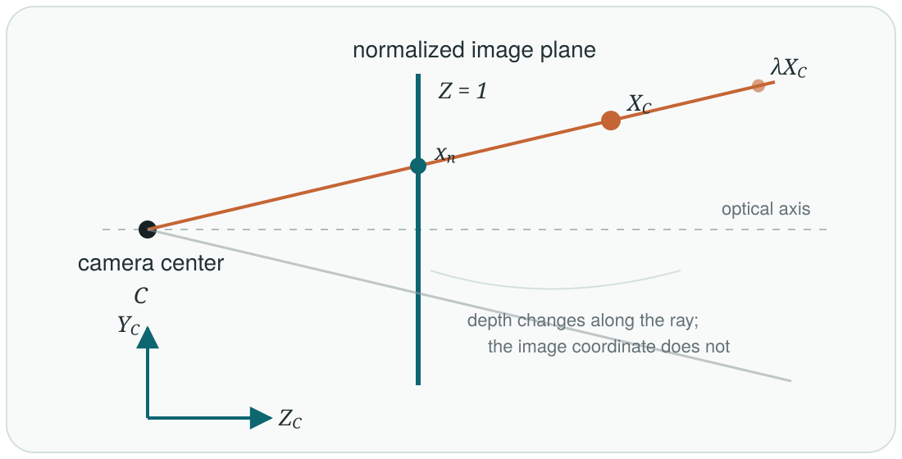

A camera model answers one foundational question: how does a point in three-dimensional space become a point in a two-dimensional image? The compact answer is

\[
\tilde{x} \sim P\tilde{X}_W.
\]

Here, \(\tilde{X}_W \in \mathbb{P}^3\) is a homogeneous 3D point, \(\tilde{x} \in \mathbb{P}^2\) is a homogeneous image point, and \(P \in \mathbb{R}^{3\times4}\) is the camera matrix. The symbol \(\sim\) means equality up to a nonzero scale. This single relation is the starting point for calibration, pose estimation, stereo vision, triangulation, and structure from motion.

## Coordinate Convention

Before deriving the projection, we need to specify the direction of every transformation. Let a world point be \(X_W\), and adopt the world-to-camera convention

\[
X_C = RX_W + t.
\]

The rotation \(R\) and translation \(t\) therefore convert coordinates expressed in the world frame into coordinates expressed in the camera frame. They are not, in this form, the camera pose in the world frame. Keeping this distinction explicit prevents one of the most common camera-geometry mistakes.

## The Pinhole Model

The ideal pinhole camera maps every visible 3D point along a ray through the camera center onto an image plane. Consider a point in camera coordinates,

\[
X_C = \begin{bmatrix}X_C & Y_C & Z_C\end{bmatrix}^{\mathsf T},
\qquad Z_C > 0.
\]

Intersecting its ray with the normalized image plane \(Z=1\) gives

\[
x_n = \frac{X_C}{Z_C},
\qquad
y_n = \frac{Y_C}{Z_C}.
\]

<figure class="article-figure-wide">
  
  <figcaption>Figure 1. Perspective projection maps a 3D point to the intersection of its camera ray with the normalized image plane. Points on the same ray produce the same image location.</figcaption>
</figure>

The division by \(Z_C\) creates perspective: more distant points appear smaller. It also removes absolute depth. For any positive scalar \(\lambda\), the points \(X_C\) and \(\lambda X_C\) lie on the same ray and project to the same normalized coordinate. A single ideal image therefore constrains a 3D point to a ray, not to a unique depth.

## Homogeneous Coordinates

Perspective division is nonlinear in ordinary Cartesian coordinates. Homogeneous coordinates let us express the projection as a matrix multiplication followed by one normalization step.

A world point and an image point are represented as

\[
\tilde{X}_W =
\begin{bmatrix}
X_W & Y_W & Z_W & 1
\end{bmatrix}^{\mathsf T},
\qquad
\tilde{x} =
\begin{bmatrix}
u' & v' & w'
\end{bmatrix}^{\mathsf T}.
\]

The Euclidean pixel coordinate is recovered by dehomogenization:

\[
u = \frac{u'}{w'},
\qquad
v = \frac{v'}{w'},
\qquad w' \neq 0.
\]

This explains both the dimensions of \(P\) and the projective scale ambiguity:

\[
\underbrace{\tilde{x}}_{3\times1}
\sim
\underbrace{P}_{3\times4}
\underbrace{\tilde{X}_W}_{4\times1}.
\]

The relation is not an ordinary Euclidean equality. Multiplying \(\tilde{x}\) or \(P\) by any nonzero scalar leaves the represented image point unchanged.

## From World Coordinates to Pixels

For an ideal perspective camera, the projection matrix factors as

\[
P = K\begin{bmatrix}R & t\end{bmatrix}.
\]

This factorization separates two different operations. The extrinsics \(\begin{bmatrix}R&t\end{bmatrix}\) change coordinates from the world frame to the camera frame. The intrinsic matrix \(K\) converts normalized camera coordinates into pixel coordinates. The complete chain is

\[
\lambda
\begin{bmatrix}
u\\v\\1
\end{bmatrix} =
K\begin{bmatrix}R&t\end{bmatrix}
\begin{bmatrix}
X_W\\Y_W\\Z_W\\1
\end{bmatrix},
\qquad \lambda \neq 0.
\]

Conceptually, the pipeline is

\[
\text{world point}
\xrightarrow{\ [R\mid t]\ }
\text{camera point}
\xrightarrow{\ \text{divide by }Z_C\ }
\text{normalized image point}
\xrightarrow{\ K\ }
\text{pixel}.
\]

## Intrinsic Parameters

The intrinsic matrix is commonly written as

\[
K =
\begin{bmatrix}
f_x & s & c_x\\
0 & f_y & c_y\\
0 & 0 & 1
\end{bmatrix}.
\]

The focal lengths \(f_x\) and \(f_y\) are measured in pixels, \((c_x,c_y)\) is the principal point, and \(s\) is the skew between the pixel axes. Modern cameras usually have negligible skew, so many implementations set \(s=0\).

Applying \(K\) after perspective division gives

\[
u = f_x x_n + s y_n + c_x,
\qquad
v = f_y y_n + c_y.
\]

The same physical focal length can produce different values of \(f_x\) and \(f_y\) because these quantities include pixel scale. If an image is resized, the focal lengths and principal point must be scaled consistently with the image coordinates.

## Extrinsic Parameters and Camera Center

Under our convention,

\[
X_C = RX_W+t,
\]

the extrinsics describe a change of coordinates from world to camera. The vector \(t\) is therefore not generally the camera center expressed in world coordinates.

The camera center \(C_W\) is the world point that maps to the camera-frame origin. Setting \(X_C=0\) gives

\[
RC_W+t=0,
\qquad
C_W=-R^{\mathsf T}t,
\]

because \(R^{-1}=R^{\mathsf T}\). In homogeneous coordinates, the same geometric fact appears as

\[
P\tilde{C}_W=0.
\]

Thus, the camera center is the right null vector of \(P\). Every image measurement defines a ray passing through this center.

## A Numerical Projection

Consider a calibrated camera with zero skew,

\[
K=
\begin{bmatrix}
800&0&640\\
0&800&360\\
0&0&1
\end{bmatrix},
\]

and a point already expressed in camera coordinates:

\[
X_C=
\begin{bmatrix}
0.2&0.1&2.0
\end{bmatrix}^{\mathsf T}\text{ m}.
\]

Perspective division produces

\[
(x_n,y_n)=\left(0.1,0.05\right).
\]

Applying the intrinsics gives

\[
u=800(0.1)+640=720,
\qquad
v=800(0.05)+360=400.
\]

The 3D point therefore projects to pixel \((720,400)\). This small example captures the full ideal pipeline: change frames if necessary, divide by depth, and apply the intrinsics.

## Where the Ideal Model Stops

The matrix \(P=K[R\mid t]\) models ideal perspective projection, but a real imaging pipeline needs several additional checks. A geometrically projected point must lie in front of the camera and within the image bounds to be visible. Real lenses also introduce radial and tangential distortion, which cannot be absorbed into a single \(3\times4\) projective matrix.

In practice, calibration estimates \(K\), distortion coefficients, and one or more camera poses. Projection code then transforms a world point into the camera frame, normalizes by depth, applies distortion in normalized coordinates, and finally converts to pixels. Mixing distorted observations with an undistorted pinhole model is a common source of systematic reprojection error.

## Takeaway

The equation \(\tilde{x}\sim P\tilde{X}_W\) is compact, but it contains a complete geometric pipeline. Extrinsics determine how the world is viewed from the camera, perspective division removes depth along each viewing ray, and intrinsics express the result in pixels. Once these conventions are fixed, multiple-view geometry can ask the inverse question: given corresponding image rays from several cameras, what 3D structure produced them?

## References

1. Richard Hartley and Andrew Zisserman, [*Multiple View Geometry in Computer Vision*, Second Edition](https://www.robots.ox.ac.uk/~vgg/hzbook/).
2. OpenCV, [Camera Calibration and 3D Reconstruction](https://docs.opencv.org/4.x/d9/d0c/group__calib3d.html).
3. OpenCV, [Camera Calibration Tutorial](https://docs.opencv.org/4.x/dc/dbb/tutorial_py_calibration.html).
