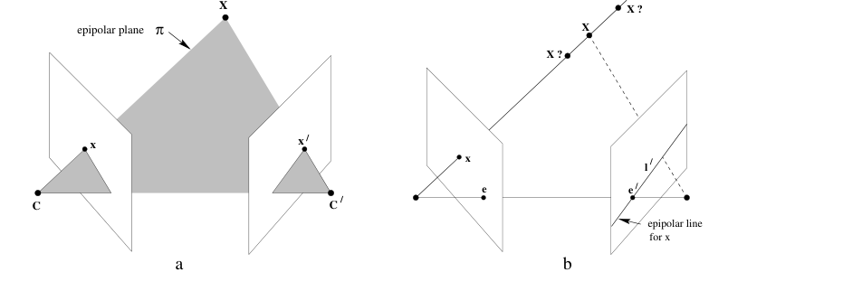
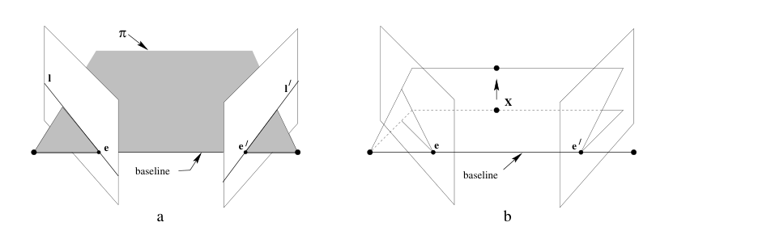

[Part I](/blog/multi-view-geometry-camera-models/) followed one 3D point through one camera:

\[
x\sim PX.
\]

That model leaves an unavoidable ambiguity. A pixel tells us the direction of a scene point from the camera center, but not its depth. In other words, an image point corresponds to a 3D viewing ray rather than to one known 3D location.

Two views do not remove that ambiguity all at once, but they constrain it sharply. The central fact of this article is:

A point in one image cannot match an arbitrary point in the other image. Its match must lie on one particular line.

That line is the epipolar line. The rest of epipolar geometry explains where it comes from, how it is written as a matrix equation, and why it turns correspondence from a two-dimensional search into a one-dimensional one.

## From One Image Point to a Line in the Other

Consider a point \(x\) in the first image. By the pinhole model, its unknown 3D source point \(X\) lies somewhere on the ray that starts at the first camera center \(C\) and passes through \(x\). The depth of \(X\) can vary anywhere along that ray without changing the first observation.

Now project every possible point on that ray into a second camera with center \(C'\). Their projections sweep out a line in the second image, not a single point. The true correspondence \(x'\) must lie somewhere on that line.

<figure class="article-figure-wide">
  
  <figcaption>Figure 1. Point correspondence geometry. The left construction shows the epipolar plane; the right construction shows why the back-projected ray of \(x\) becomes the line \(l'\) in the second view. Reproduced from Hartley and Zisserman, Fig. 9.1.</figcaption>
</figure>

This is the geometric reason that the correspondence is a line. The first image has told us which ray contains \(X\), but it has not chosen a depth along that ray. The second image records the projection of every depth still allowed by that first observation.

## Back-Projecting a Pixel Is Not Inverting a Camera

It is tempting to write \(X=P_1^{-1}x\) for a pixel \(x=(u,v,1)^{\mathsf T}\) in the first image, and then substitute it into \(x'\sim P_2X\). That notation hides the central issue: \(P_1\) is a \(3\times4\) projection matrix, not an invertible change of coordinates. More importantly, perspective projection has discarded depth. One image point has infinitely many possible 3D preimages.

The inverse operation is therefore a back-projection to a ray, not an inverse to one 3D point. Write the two cameras using the Part I convention,

\[
P_i=K_i\begin{bmatrix}R_i&t_i\end{bmatrix},
\qquad
X_{C_i}=R_iX_W+t_i.
\]

The first camera center in world coordinates is

\[
C_1=-R_1^{\mathsf T}t_1.
\]

Undoing the intrinsic mapping sends \(x\) to the normalized camera direction \(K_1^{-1}x\). Rotating that direction into the world frame gives the complete family of world points consistent with \(x\):

\[
X_W(\lambda)=C_1+\lambda R_1^{\mathsf T}K_1^{-1}x,
\qquad \lambda>0.
\]

Here \(\lambda\) is the unknown depth along the ray. Projecting this family into the second camera gives

\[
x'(\lambda)\sim
K_2\left(
R_2\bigl(C_1+\lambda R_1^{\mathsf T}K_1^{-1}x\bigr)+t_2
\right).
\]

This is the algebraic version of Figure 1. Varying \(\lambda\) moves \(X_W\) along one ray. Its projections \(x'(\lambda)\) trace the epipolar line in image 2. Thus the composition is not \(P_2P_1^{-1}x\), which would incorrectly promise a single point; it is <em>back-project a pixel to a ray, then project every point on that ray</em>.

## The Plane That Connects the Two Views

The bridge between the two images is the epipolar plane. For a scene point \(X\), the first camera center \(C\), the second camera center \(C'\), and \(X\) lie in a common plane. The plane intersects the first image plane in a line \(l\), and the second image plane in a line \(l'\). Those are the two epipolar lines.

The construction makes the correspondence constraint almost inevitable:

\[
x\in l,
\qquad
x'\in l'.
\]

The particular epipolar plane changes as \(X\) changes. Its common axis does not: every epipolar plane contains the baseline \(CC'\), the line joining the two camera centers. This shared baseline gives the family of epipolar lines a common image point.

## Epipoles: Where All Epipolar Lines Meet

The epipole in the second image, denoted \(e'\), is the projection of the first camera center \(C\) into the second image. Similarly, \(e\) is the projection of \(C'\) into the first image:

\[
e'\sim P'C,
\qquad
e\sim PC'.
\]

Every epipolar plane contains the baseline \(CC'\). Therefore every epipolar line in the second image contains the projection of \(C\), namely \(e'\); every epipolar line in the first image contains \(e\). The epipoles are the vanishingly simple signature of the other camera's location: <em>the epipole is the other camera center, seen in this image.</em>

This is also a useful visual check. When the relative camera motion is mainly sideways, epipolar lines often look close to horizontal. When one camera moves toward or away from the other, they fan out from an epipole that may lie inside the image.

## The Fundamental Matrix: Point to Line

Image lines are represented in homogeneous coordinates by a vector

\[
l=
\begin{bmatrix}
a&b&c
\end{bmatrix}^{\mathsf T},
\]

so that a point \(x\) lies on \(l\) precisely when \(x^{\mathsf T}l=0\).

For an uncalibrated pair of cameras, the fundamental matrix \(F\) maps a point in either image to its epipolar line in the other:

\[
l'=Fx,
\qquad
l=F^{\mathsf T}x'.
\]

Since the matching point \(x'\) must lie on \(l'\), every correct correspondence satisfies

\[
x'^{\mathsf T}Fx=0.
\]

This is the fundamental epipolar constraint. It is not a distance or a similarity score. It is an incidence statement: the point \(x'\) lies on the line generated from \(x\). The matrix \(F\) is defined only up to a nonzero scale and has rank two; its left and right null vectors are the two epipoles:

\[
e'^{\mathsf T}F=0,
\qquad
Fe=0.
\]

<figure class="article-figure-wide">
  
  <figcaption>Figure 2. The baseline intersects the image planes at the epipoles \(e,e'\). As the epipolar plane rotates about the baseline, its intersections with the image planes form the two pencils of epipolar lines. Reproduced from Hartley and Zisserman, Fig. 9.2.</figcaption>
</figure>

## What \(F\) Encodes

The fundamental matrix belongs to a camera pair, not to one scene point. Once the two cameras are fixed, the same \(F\) constrains every genuine correspondence between their images. It encodes their relative pose together with the cameras' intrinsic calibration.

The connection to Part I becomes especially clear when both cameras are calibrated. Choose the first camera as the reference frame, so that

\[
P=K\begin{bmatrix}I&0\end{bmatrix},
\qquad
P'=K'\begin{bmatrix}R&t\end{bmatrix}.
\]

In this reference frame, the first ray has the particularly simple form

\[
X_1(\lambda)=\lambda K^{-1}x.
\]

Substitution into the second projection gives

\[
x'(\lambda)\sim K'\left(\lambda RK^{-1}x+t\right).
\]

To make the geometry in this expression visible, define

\[
a=K'RK^{-1}x,
\qquad
b=K't.
\]

Then \(x'(\lambda)\sim\lambda a+b\). At \(\lambda=0\), the expression becomes \(b\), which is the image of the first camera center in the second view:

\[
e'\sim b=K't.
\]

At very large depth, divide the homogeneous vector by \(\lambda\), which does not change the represented image point:

\[
x'(\lambda)\sim a+\frac{1}{\lambda}b
\longrightarrow a=K'RK^{-1}x.
\]

Thus every \(x'(\lambda)\) is a linear combination of the two homogeneous point vectors \(a\) and \(b\). In a projective image plane, all such combinations form the line through those two points. The homogeneous vector for the line through \(b\) and \(a\) is their cross product,

\[
l'\sim b\times a=[b]_\times a=[K't]_\times K'RK^{-1}x.
\]

To connect this geometric line construction to the standard fundamental-matrix form, use the cross-product identity

\[
[K't]_\times
=\det(K')\,K'^{-\mathsf T}[t]_\times K'^{-1}.
\]

Substituting it into the line equation gives

\[
\begin{aligned}
l'
&\sim [K't]_\times K'RK^{-1}x\\
&=\det(K')\,K'^{-\mathsf T}[t]_\times RK^{-1}x.
\end{aligned}
\]

The scalar \(\det(K')\) can be discarded because homogeneous lines are defined only up to scale. Therefore

\[
l'\sim
\underbrace{K'^{-\mathsf T}[t]_\times RK^{-1}}_{F}x.
\]

The incidence can also be checked directly:

\[
l'^{\mathsf T}x'(\lambda)
=(b\times a)^{\mathsf T}(\lambda a+b)=0,
\]

because \(b\times a\) is perpendicular to both \(a\) and \(b\). This is already the point-to-line map \(l'=Fx\). The relative rotation \(R\) changes the viewing direction between cameras, while \(t\) supplies the baseline that makes the line constraint possible. In normalized image coordinates, the same relation is expressed by the essential matrix

\[
E=[t]_\times R,
\qquad
\bar{x}'^{\mathsf T}E\bar{x}=0,
\]

where \([t]_\times v=t\times v\). Converting normalized points to pixels using the two intrinsic matrices gives

\[
F=K'^{-\mathsf T}EK^{-1}.
\]

Thus \(F\) packages the same ingredients introduced in Part I—camera orientation, camera displacement, and the two mappings from rays to pixels—into a relation between image points. When calibration is unavailable, \(F\) can still be estimated directly from correspondences; it then captures the projective relation without separately recovering \(K\), \(R\), or \(t\).

## Why a Line Changes Matching

Without geometry, matching a feature at \(x\) in the first image means searching the full two-dimensional area of the second image. The fundamental matrix reduces that search to the one-dimensional locus \(l'=Fx\).

This has three immediate consequences:

- Candidate matches far from the epipolar line can be rejected.
- Feature descriptors need be compared only along a narrow band around the line.
- A set of plausible matches can be tested for geometric consistency with one shared \(F\).

In practice, estimated feature matches contain outliers. Robust methods such as RANSAC use the epipolar constraint to find a fundamental matrix supported by a consistent subset, then reject matches with a large point-to-line error. The constraint does not identify the correct match by itself—repeated textures and occlusion still matter—but it makes impossible matches easy to rule out.

## A Constraint, Not Yet a Reconstruction

Epipolar geometry tells us where the corresponding observation may be. It does not yet select the exact location on the line, nor does it determine the 3D point by itself. Once a match \(x\leftrightarrow x'\) is found, the two viewing rays can be intersected or, in noisy data, triangulated to estimate \(X\).

The geometry also has degenerate cases. With pure camera rotation, the centers coincide and there is no nonzero baseline to form the usual family of epipolar planes; image-to-image mapping is instead described by a homography. With very small baselines or inaccurate calibration, the epipolar constraint becomes numerically less informative. These are limitations of the viewing configuration, not failures of the idea.

## Closing Perspective

The move from one view to two views changes the question. Part I asked how a 3D point produces one image point. This part asks what two image points must have in common if they came from the same 3D point.

The answer can be retained as four connected statements:

1. An image point defines a 3D viewing ray.
2. That ray and the two camera centers define an epipolar plane.
3. The plane cuts the other image in an epipolar line.
4. The fundamental matrix writes this fact as \(x'^{\mathsf T}Fx=0\).

The next step is to turn that constrained pair of rays back into a 3D estimate through triangulation.

## References

1. Richard Hartley and Andrew Zisserman, [*Multiple View Geometry in Computer Vision*, Second Edition](https://www.robots.ox.ac.uk/~vgg/hzbook/).
2. OpenCV, [Epipolar Geometry](https://docs.opencv.org/4.x/da/de9/tutorial_py_epipolar_geometry.html).
