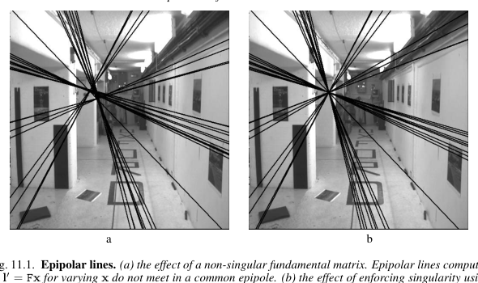
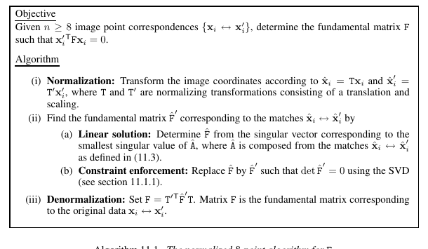

[Part I](/blog/multi-view-geometry-camera-models/) built one camera, and [Part II](/blog/multi-view-geometry-epipolar-geometry/) established the constraint between two images:

\[
x'^{\mathsf T}Fx=0.
\]

Part III asks the computational question left open by that equation: given noisy point matches, how do we actually estimate (F)? The answer begins as linear algebra, but it ends as an estimation problem. The bridge is the normalized 8-point algorithm.

From many tentative matches, estimate one matrix that makes their epipolar geometry mutually consistent.

## The Input Is Correspondence, Not 3D Reconstruction

Assume a matcher has supplied image correspondences

\[
x_i\leftrightarrow x'_i,
\qquad
x_i=(x_i,y_i,1)^{\mathsf T},
\quad
x'_i=(x'_i,y'_i,1)^{\mathsf T}.
\]

The coordinates are homogeneous image points. At this stage we do not know the 3D point that generated either observation; we only hypothesize that both points depict the same scene location. If the hypothesis is correct, the pair must obey

\[
x_i'^{\mathsf T}Fx_i=0.
\]

So the objective is not to fit a line to points in one image. It is to find one <em>3 × 3</em> matrix <em>F</em> that makes every first-image point induce an epipolar line in the second image on which its partner lies.

## Why the Fundamental Matrix Has Seven Degrees of Freedom

The <em>3 × 3</em> matrix <em>F</em> has nine entries, but its homogeneous scale carries no geometry:

\[
F\sim\lambda F,
\qquad \lambda\ne0.
\]

That removes one degree of freedom. A valid fundamental matrix must also be singular,

\[
\det(F)=0,
\qquad \operatorname{rank}(F)=2,
\]

which removes one more. Thus the set of valid fundamental matrices has (9-1-1=7) degrees of freedom. This explains two names that otherwise sound contradictory: seven correspondences are theoretically minimal, while eight correspondences give a particularly convenient linear algorithm.

## One Match Becomes One Row of a Linear System

Write the entries of (F) as one vector,

\[
f=(f_{11},f_{12},f_{13},f_{21},f_{22},f_{23},f_{31},f_{32},f_{33})^{\mathsf T}.
\]

Expanding the epipolar constraint for one correspondence produces

\[
\begin{bmatrix}
x'x & x'y & x' & y'x & y'y & y' & x & y & 1
\end{bmatrix}f=0.
\]

Every point pair contributes one such row. Stacking (n) pairs gives

\[
Af=0,
\qquad
A\in\mathbb R^{n\times9}.
\]

With eight or more non-degenerate matches, the direct estimate is the unit vector <em>f</em> in the right null-space of <em>A</em>. With noisy data, this becomes a least-squares problem. This is where the first SVD appears:

\[
A=U_A\operatorname{diag}(s_1,\ldots,s_9)V_A^{\mathsf T},
\qquad s_1\ge\cdots\ge s_9.
\]

The last column of <em>V</em>A is the right singular vector associated with the smallest singular value <em>s</em>9. It is the unit vector that makes <em>Af</em> as small as possible, so we take it as <em>f</em> and reshape its nine entries into a 3 × 3 matrix <em>F&#770;</em>.

This is the entire linear heart of the 8-point algorithm. The fact that it is linear is useful, but it also hides two issues: the raw solution usually has rank three, and pixel coordinates make the system poorly conditioned.

## Rank Two Is a Geometric Requirement

The unconstrained least-squares matrix <em>F&#770;</em> is merely *close to* a fundamental matrix. Noise means it will generally have three non-zero singular values. But a real <em>F</em> has a left and a right null vector—the epipoles—so it must have rank two.

This calls for a second, separate SVD. It is not used to solve the point equations; it repairs the geometry of the matrix obtained from the first SVD. Take

\[
\hat F=U_F\operatorname{diag}(\sigma_1,\sigma_2,\sigma_3)V_F^{\mathsf T},
\qquad \sigma_1\ge\sigma_2\ge\sigma_3.
\]

Set the smallest singular value to zero and reassemble:

\[
F=U_F\operatorname{diag}(\sigma_1,\sigma_2,0)V_F^{\mathsf T}.
\]

This is the nearest rank-two matrix to <em>F&#770;</em> in Frobenius norm. In short: the SVD of <em>A</em> selects the best linear fit; the SVD of <em>F&#770;</em> removes the one singular-value direction that violates epipolar geometry. The first works in a 9-dimensional vector space of matrix entries; the second projects the resulting 3 × 3 matrix back onto the geometrically legal set.

<figure class="article-figure-wide">
  
  <figcaption>Figure 1. Rank matters visibly. A non-singular estimate produces epipolar lines that do not meet at a common epipole; enforcing rank two restores that geometry. Reproduced from Hartley and Zisserman, Fig. 11.1.</figcaption>
</figure>

## Normalization Makes the Linear Solve Trustworthy

Raw pixel coordinates may be in the hundreds or thousands while the final homogeneous coordinate is (1). Those unequal scales make (A) ill-conditioned: a small perturbation in one coordinate can produce a disproportionately large perturbation in the null-space estimate.

Hartley's normalized 8-point algorithm first finds a similarity transform (T) for the first image and (T') for the second such that the transformed points

\[
\tilde x_i=Tx_i,
\qquad
\tilde x'_i=T'x'_i
\]

have centroid at the origin and root-mean-square distance √2 from it. Estimate the normalized fundamental matrix from these normalized coordinates, enforce its rank-two constraint, then undo the coordinate changes:

\[
F=T'^{\mathsf T}\tilde F T.
\]

The transpose on <em>T′</em> is not a cosmetic detail. A line transforms contravariantly: transforming an image point by <em>T′</em> requires the corresponding dual transformation on a line. Thus, in original coordinates, the recovered matrix is exactly the display equation above. This is why normalization can be performed before estimation without changing the geometric relation being sought.

<figure class="article-figure-wide">
  
  <figcaption>Figure 2. The normalized 8-point algorithm is short but complete: normalize, solve linearly, enforce singularity, and denormalize. Reproduced from Hartley and Zisserman, Algorithm 11.1.</figcaption>
</figure>

## Seven Points Are Minimal; Eight Points Are Usually the First Tool

With exactly seven correspondences, (A) normally has a two-dimensional null-space. Let its basis matrices be (F_1) and (F_2). Every linear solution has the form

\[
F(\alpha)=\alpha F_1+(1-\alpha)F_2.
\]

Enforcing singularity gives

\[
\det(F(\alpha))=0,
\]

a cubic polynomial in (alpha). It can yield one or three real fundamental matrices. The 7-point algorithm is therefore minimal and useful inside robust sampling methods, but it has multiple candidate solutions. The 8-point algorithm uses one extra match to obtain a one-dimensional null-space and one direct linear candidate before rank enforcement.

## Estimation Needs an Error Model

With real matches, no (F) makes every residual exactly zero. The scalar

\[
r_i=x_i'^{\mathsf T}Fx_i
\]

is the algebraic residual. It is convenient because it is what makes (Af=0) linear, but it is not a distance measured in pixels. A more geometric quantity measures the distance from a point to its predicted epipolar line; the Sampson error is a first-order approximation to that geometric reprojection error:

\[
d_{\mathrm{Sampson}}^2(x,x',F)=
\frac{(x'^{\mathsf T}Fx)^2}
{(Fx)_1^2+(Fx)_2^2+(F^{\mathsf T}x')_1^2+(F^{\mathsf T}x')_2^2}.
\]

The denominator converts the residual into an image-space scale using the line coefficients. The practical lesson is simple: linear algebra gives an initial estimate; meaningful geometry decides how to refine and evaluate it.

## From the Chapter to a Real Pipeline

Feature matching produces many false correspondences, so no least-squares method should be trusted on all matches at once. A typical workflow is:

1. detect and match features;
2. repeatedly sample a small set of matches and estimate (F) with a normalized 8-point method, or a 7-point minimal solver;
3. score every match using an epipolar distance or Sampson error;
4. keep the largest consensus set with RANSAC;
5. re-estimate (F) from those inliers and enforce rank two.

Chapter 9 said that (F) turns a two-dimensional correspondence search into a one-dimensional search. Chapter 11 explains how to obtain the matrix that supplies those lines from imperfect evidence.

## The Five Things to Keep

- Every correspondence supplies one linear equation in the entries of (F).
- (F) has seven degrees of freedom: scale is irrelevant and rank two is required.
- The first SVD, on <em>A</em>, solves the noisy linear system by selecting its smallest right singular vector.
- The second SVD, on the reshaped estimate <em>F&#770;</em>, sets its smallest singular value to zero and enforces rank two.
- Both SVD steps and point normalization are essential parts of the algorithm, not optional cleanup.
- In practice, (F) is estimated robustly from noisy matches with RANSAC and a geometric error measure.

## Reference

R. Hartley and A. Zisserman. *Multiple View Geometry in Computer Vision*, 2nd ed., Cambridge University Press, 2004. Chapter 11, “Computation of the Fundamental Matrix (F).”
