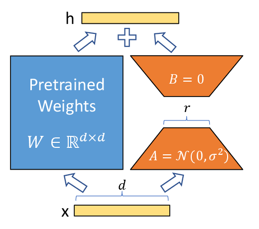

Adapt the change a task needs, not necessarily every pretrained weight.

Pretraining gives a large model broad capabilities, but a downstream task usually needs a narrower adjustment: a new instruction style, domain vocabulary, camera distribution, or action interface. Full fine-tuning updates every pretrained parameter. It is expressive, but expensive because training memory must hold not only weights, but also gradients and optimizer states.

Parameter-efficient fine-tuning, or PEFT, keeps most pretrained weights frozen and learns a much smaller set of new parameters. This note follows one especially influential family:

\[
\text{LoRA}
\quad\longrightarrow\quad
\text{QLoRA and DoRA}
\quad\longrightarrow\quad
\text{QDoRA}.
\]

The methods share the same central question: how can a large pretrained linear map be changed with a small trainable update? They differ in which bottleneck they target. LoRA reduces trainable parameters; QLoRA further reduces frozen-model memory; DoRA gives the low-rank update a more flexible parameterization; QDoRA combines the latter two choices.

## The Baseline: Full Fine-Tuning

Consider one pretrained linear layer,

\[
\mathbf{h}=W_0\mathbf{x},
\qquad
W_0\in\mathbb R^{d_{\mathrm{out}}\times d_{\mathrm{in}}}.
\]

The input is <em>x</em>, the output is <em>h</em>, and <em>W</em>0 is the pretrained weight matrix. Full fine-tuning replaces it with a fully trainable matrix <em>W</em>:

\[
W=W_0+\Delta W,
\qquad
\Delta W\in\mathbb R^{d_{\mathrm{out}}\times d_{\mathrm{in}}}.
\]

This update has <em>d</em>out<em>d</em>in free parameters for one layer. For a Transformer, repeating this across attention and MLP projections quickly makes optimizer-state memory the limiting resource.

PEFT does not claim that all full updates are inherently wasteful. It makes a modeling assumption: the task-specific change can often be represented in a lower-dimensional subspace.

## LoRA: Learn a Low-Rank Residual

LoRA freezes <em>W</em>0 and writes the update as a product of two thin matrices [1]:

\[
W'=W_0+\Delta W,
\qquad
\Delta W=\frac{\alpha}{r}BA,
\]

with

\[
A\in\mathbb R^{r\times d_{\mathrm{in}}},
\qquad
B\in\mathbb R^{d_{\mathrm{out}}\times r},
\qquad
r\ll\min(d_{\mathrm{in}},d_{\mathrm{out}}).
\]

The integer <em>r</em> is the adapter rank. Instead of learning <em>d</em>out<em>d</em>in values, LoRA learns

\[
r(d_{\mathrm{in}}+d_{\mathrm{out}})
\]

values. The ratio <em>α</em>/<em>r</em> scales the update and lets the chosen rank change without silently changing the initial update scale.

<figure class="article-figure-medium">
  
  <figcaption>Figure 1. LoRA leaves the pretrained matrix frozen and adds a trainable low-rank path. The usual initialization makes the adapter update zero at the start of fine-tuning. Reproduced from [1, Fig. 1].</figcaption>
</figure>

The diagram also explains a practical initialization choice. Set <em>A</em> randomly and <em>B</em> to zero. Then <em>BA = 0</em> initially, so the adapted layer begins exactly as the pretrained layer. Training gradually learns a task-specific residual instead of perturbing the base model on the first step.

At inference, the residual can be merged into the base matrix:

\[
W_{\mathrm{merged}}=W_0+\frac{\alpha}{r}BA.
\]

For a standard linear layer, this means LoRA need not add a second matrix multiplication at deployment. Keeping adapters separate is still useful when one base model serves multiple tasks, because each task can load a different small adapter.

### Rank is capacity, not a quality guarantee

A rank-one update changes the layer along one output-input factorization; a larger rank permits more independent directions of change. But rank is only one design choice. The target modules matter just as much.

For an attention block, common targets include query and value projections, often written as <em>W</em>Q and <em>W</em>V. Adapting all linear layers gives the optimizer more reach, but costs more adapter parameters. The PEFT configuration should therefore state at least:

1. which modules receive adapters;
2. the rank and scaling used for each target;
3. whether non-adapter modules, such as a new classifier or action head, remain fully trainable.

“Trained with LoRA” alone does not specify the effective adaptation budget.

## QLoRA: Keep the Same Adapter, Store the Backbone More Cheaply

Standard LoRA freezes the backbone, but the frozen weights still occupy accelerator memory. QLoRA addresses that different bottleneck [2]. It stores the pretrained weight in quantized form while training LoRA adapters in higher precision:

\[
W'=Q(W_0)+\frac{\alpha}{r}BA.
\]

Here <em>Q</em>(<em>W</em>0) denotes a frozen quantized representation that is dequantized as needed for computation. The low-rank matrices <em>A</em> and <em>B</em> remain the trainable part.

This distinction prevents a common confusion: QLoRA is not a new low-rank update rule. The adapter is still LoRA. The main change is how the large frozen backbone is stored and used during training.

The original QLoRA recipe combines three engineering ideas [2]:

1. NF4, a 4-bit datatype designed for weights with approximately normal distributions;
2. double quantization, which also quantizes quantization constants;
3. paged optimizers, which help manage temporary memory spikes.

These choices make a much larger model accessible on limited hardware, but they do not make quantization free. The relevant experiment is not “does QLoRA use less memory?”—it does—but whether the quantization, optimizer setup, target modules, data, and downstream task preserve the quality needed for a particular use case.

## DoRA: Separate Magnitude from Direction

LoRA constrains the entire update <em>ΔW</em> to be low rank. DoRA asks whether this is too restrictive because full fine-tuning may change both the length and direction of each weight vector in different ways [3].

For a weight matrix whose columns are treated as vectors, write a magnitude-direction decomposition schematically as

\[
W_0=\mathbf{m}_0\odot
\frac{W_0}{\lVert W_0\rVert_c}.
\]

The vector <em>m</em>0 contains one column magnitude, <em>‖W</em>0<em>‖</em>c denotes column-wise norms broadcast across rows, and <em>⊙</em> is element-wise multiplication after broadcasting. DoRA keeps LoRA for the directional adjustment, then learns magnitudes separately:

\[
W'=\mathbf{m}\odot
\frac{W_0+\frac{\alpha}{r}BA}
{\left\lVert W_0+\frac{\alpha}{r}BA\right\rVert_c}.
\]

The numerator supplies a low-rank directional change. The learnable vector <em>m</em> supplies magnitude changes. This adds few parameters relative to the large matrix, but gives the adapter a degree of freedom that plain LoRA lacks.

DoRA is not automatically the better choice. It is a more expressive adaptation parameterization, with more implementation detail and a different memory/runtime profile during training. Its motivation is strongest when low-rank LoRA leaves a meaningful gap to full fine-tuning; its value should be measured against the same target modules and trainable-parameter budget.

## QDoRA: Quantized DoRA

QDoRA is the practical name for using DoRA adapters on a quantized backbone. In other words, it combines QLoRA's memory strategy with DoRA's magnitude-direction parameterization [4]. Schematically, its effective layer is

\[
W'=\mathbf{m}\odot
\frac{Q(W_0)+\frac{\alpha}{r}BA}
{\left\lVert Q(W_0)+\frac{\alpha}{r}BA\right\rVert_c}.
\]

This equation is a conceptual composition, not a claim that every implementation performs normalization in exactly this stored representation. The important separation remains clear: the frozen base is quantized for memory, the directional change is low rank, and the magnitude vector remains trainable.

QDoRA is useful when plain QLoRA fits in memory but its adapter is not expressive enough, or when DoRA's quality improvement is desirable but an unquantized backbone does not fit. It inherits both sets of trade-offs: quantization behavior and compatibility from QLoRA, plus the normalization and magnitude-path overhead of DoRA. The current PEFT implementation supports DoRA with bitsandbytes-quantized weights, while documenting caveats for some distributed-training configurations [4]. It should be treated as a configuration to validate, not as a universally superior fourth method.

## What Actually Differs?

| Method | Frozen base weights | Trainable update | Main bottleneck addressed | Main trade-off |
| --- | --- | --- | --- | --- |
| Full fine-tuning | No | Full matrix <em>ΔW</em> | No PEFT constraint | Highest training memory and parameter cost |
| LoRA | Full-precision backbone | Low-rank <em>BA</em> | Trainable parameters and optimizer states | Rank and target-module choices limit adaptation scope |
| QLoRA | Quantized backbone | The same low-rank <em>BA</em> | Backbone memory as well as trainable parameters | Quantization and implementation choices affect stability and quality |
| DoRA | Usually full-precision backbone | Low-rank direction plus learned magnitude | Expressiveness of a LoRA-style update | More involved than LoRA; benefit is task-dependent |
| QDoRA | Quantized backbone | Low-rank direction plus learned magnitude | Memory and LoRA-style expressiveness together | Inherits quantization caveats and DoRA overhead |

## The Four Ideas to Keep

1. LoRA does not retrain a small model. It freezes a large pretrained model and learns a low-rank residual inside selected layers.
2. QLoRA keeps LoRA's adapter logic but quantizes the frozen backbone to make fine-tuning fit within a smaller memory budget.
3. DoRA adds a magnitude-direction decomposition so that low-rank adaptation does not have to express both kinds of change through one residual; QDoRA uses that adapter with a quantized backbone.
4. The rank, target modules, quantization setup, and any fully trainable task head are part of the method specification, not incidental hyperparameters.

## References

1. E. J. Hu, Y. Shen, P. Wallis, Z. Allen-Zhu, Y. Li, S. Wang, L. Wang, and W. Chen. [*LoRA: Low-Rank Adaptation of Large Language Models*](https://arxiv.org/abs/2106.09685). ICLR, 2022.
2. T. Dettmers, A. Pagnoni, A. Holtzman, and L. Zettlemoyer. [*QLoRA: Efficient Finetuning of Quantized LLMs*](https://arxiv.org/abs/2305.14314). NeurIPS, 2023.
3. S.-Y. Liu, C.-Y. Wang, H. Yin, P. Molchanov, Y.-C. F. Wang, K.-T. Cheng, and M.-H. Chen. [*DoRA: Weight-Decomposed Low-Rank Adaptation*](https://arxiv.org/abs/2402.09353). ICML, 2024.
4. Hugging Face. [*PEFT Documentation: Weight-Decomposed Low-Rank Adaptation*](https://huggingface.co/docs/peft/package_reference/lora_variant_dora). Accessed September 2026.
