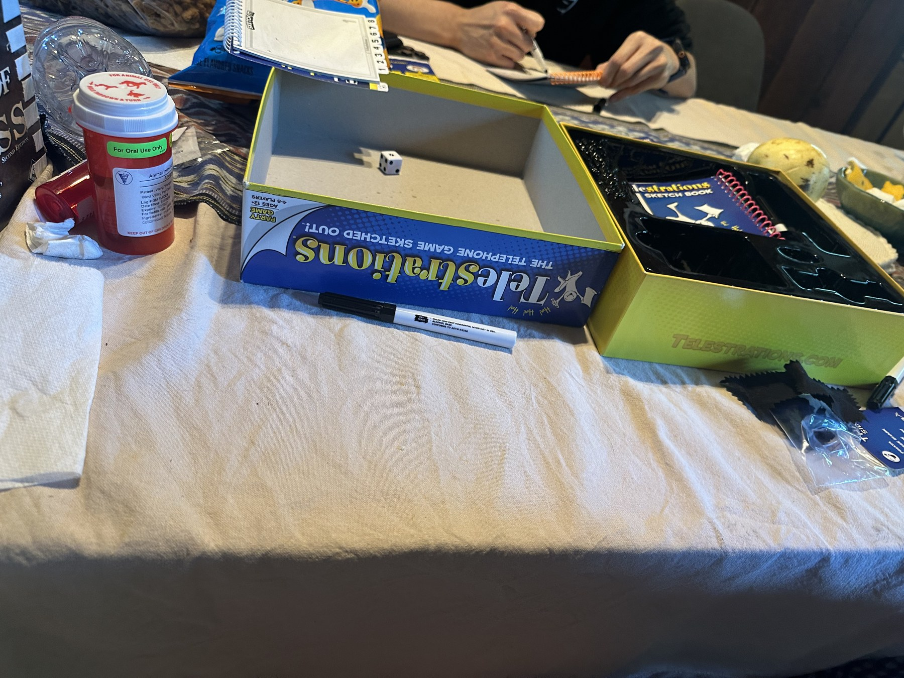
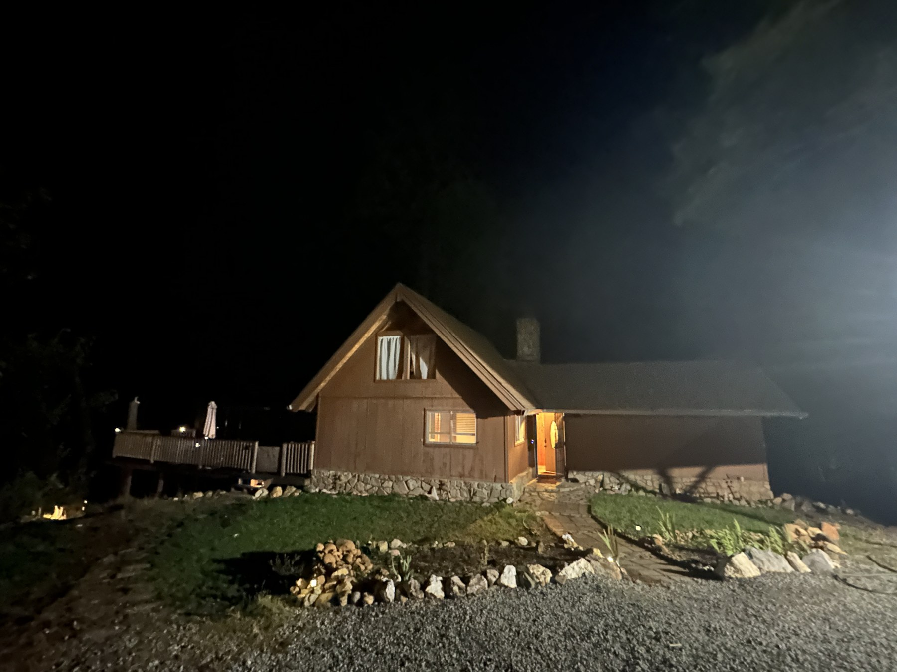
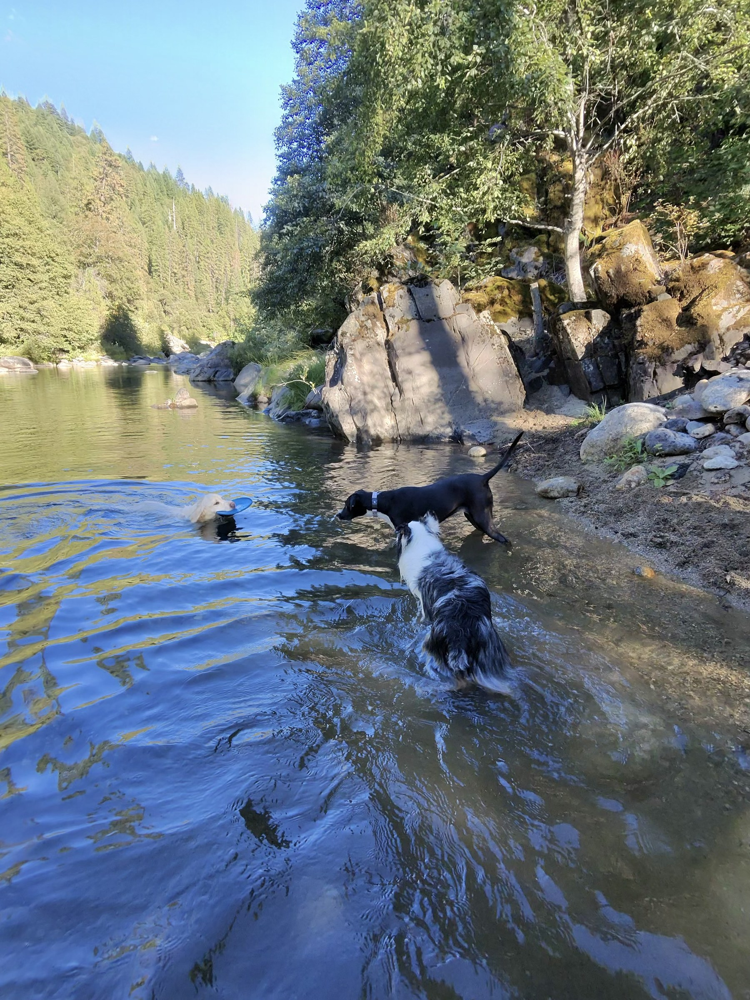

Labor Day weekend at Riverside House.

A small pause by the river: good company, a long board-game table, and time with nowhere else to be.

  <figure>
    

      
    

    <figcaption>Board games after dinner.</figcaption>
  </figure>
  <figure>
    

      
    

    <figcaption>Riverside House.</figcaption>
  </figure>
  <figure>
    

      
    

    <figcaption>By the river.</figcaption>
  </figure>

