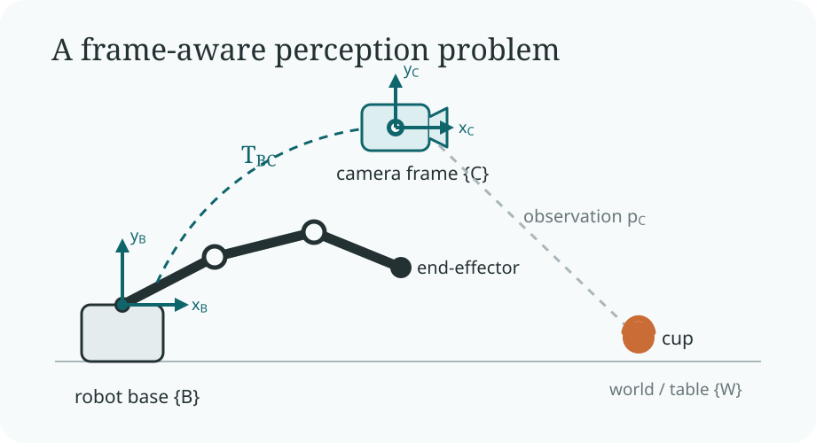

Robot kinematics is fundamentally a problem in geometry. For any object, sensor, tool, or end-effector, we want to answer two questions: where is it, and how is it oriented, relative to a specified coordinate frame?

Position contributes three degrees of freedom and orientation contributes three more, together defining a six-degree-of-freedom pose. This first part develops the notation and algebra used throughout robotics: coordinate frames, rotations in \(SO(3)\), and rigid transforms in \(SE(3)\).

## Problem Setup

In robotics, a geometric quantity is meaningful only when its reference frame is known. A controller does not merely need to detect an object; it needs the object's position expressed in the frame used for planning and control.

Consider a simple example: a robot arm sees a cup through a camera mounted somewhere in the system.

<figure class="article-figure-wide">
  
  <figcaption>Figure 1. Perception estimates the cup in the camera frame; the known camera pose maps that estimate into the robot base frame for control.</figcaption>
</figure>

Suppose a perception system estimates the cup position in the camera frame:

\[
p_C = \begin{bmatrix} 0.1 \\ 0.2 \\ 0.8 \end{bmatrix}
\]

Assume that we also know the camera pose relative to the robot base:

\[
T_{BC} : \text{camera pose in robot base frame}
\]

A perception model may tell us that the cup is \(80\) cm in front of the camera, but the robot controller operates in the base frame. We therefore need to transform the detected point from camera coordinates into base coordinates. Because \(T_{BC}\) is a \(4 \times 4\) rigid transform, it acts on the homogeneous form of the point:

\[
\tilde{p}_C = \begin{bmatrix} p_C \\ 1 \end{bmatrix},
\qquad
\tilde{p}_B = T_{BC}\tilde{p}_C
\]

This is the first principle of robot kinematics: a geometric quantity is incomplete without its reference frame.

## Notation and Coordinate Frames

A coordinate frame is a local reference system defined by an origin and three axes. A robotics system often tracks several frames at once, including the world, robot base, joints, camera, tool, and objects in the scene.

The subscript identifies the frame in which a quantity is expressed. Thus, \(p_C\) denotes the coordinates of a physical point in frame \(\{C\}\). Likewise, \(T_{BC}\) maps coordinates from frame \(\{C\}\) into frame \(\{B\}\).

A useful convention is to read
\[
T_{AB}
\]
as “transform coordinates from frame \(B\) into frame \(A\).” More explicitly,
\[
T_{AB}:\ \{B\} \rightarrow \{A\},
\qquad
\tilde p_A = T_{AB}\tilde p_B.
\]

## Frame Chains and Composition

Once a system contains more than two frames, transforms must be composed in the correct order.

For the cup observed in the camera frame, its base-frame coordinates are
\[
\tilde{p}_B = T_{BC}\tilde{p}_C.
\]
If the robot base pose in the world frame is also known, the cup can be expressed in world coordinates by composing the transforms from right to left:
\[
\tilde{p}_W = T_{WB}T_{BC}\tilde{p}_C.
\]
The corresponding camera pose in the world frame is
\[
T_{WC} = T_{WB}T_{BC}.
\]
Order matters because matrix multiplication is not commutative:
\[
T_{AB}T_{BC} \neq T_{BC}T_{AB}.
\]

## Rotation in SO(3)

Before considering full pose, it is useful to isolate orientation. A three-dimensional rotation is represented by an element of \(SO(3)\), the special orthogonal group.

The name describes its defining properties. “Orthogonal” means that \(R\) preserves inner products, and therefore lengths and angles, which gives \(R^\top R=I\). “Special” restricts the determinant to \(+1\), excluding reflections and retaining only proper, orientation-preserving rotations. The number \(3\) denotes three-dimensional space.

\[
SO(3)=\{R \in \mathbb{R}^{3 \times 3}\mid R^\top R = I,\ \det(R)=1\}
\]

Orthogonality also gives the useful identity

\[
R^{-1}=R^\top
\]

For example, rotation about the \(z\)-axis by an angle \(\theta\) is represented by

\[
R_z(\theta)=
\begin{bmatrix}
\cos\theta & -\sin\theta & 0 \\
\sin\theta & \cos\theta & 0 \\
0 & 0 & 1
\end{bmatrix}
\]

For \(\theta=90^\circ\), this becomes

\[
R_z=
\begin{bmatrix}
0 & -1 & 0 \\
1 & 0 & 0 \\
0 & 0 & 1
\end{bmatrix}
\]

Applying this rotation to a point on the positive \(x\)-axis gives

\[
p=\begin{bmatrix}1\\0\\0\end{bmatrix}
\]

\[
Rp=\begin{bmatrix}0\\1\\0\end{bmatrix}.
\]

Rotation changes direction while preserving geometric structure. Revolute joints generate precisely this kind of motion, which is why \(SO(3)\) appears throughout robot kinematics.

### From Orientation to Pose

Orientation alone does not locate an end-effector in space. Its full pose combines a rotation \(R\) with a position \(p\):

\[
(R, p)
\]

For a robot arm, this pose is determined by the upstream joint rotations and the fixed geometry of the links. Forward kinematics computes the resulting pose by accumulating rotations and translations along the kinematic chain. Keeping those two components separate, however, becomes inconvenient when many transforms must be composed.

## Rigid Transforms in SE(3)

A rigid motion acts on a point by rotating it and then translating it:

\[
p' = Rp + t
\]

Homogeneous coordinates let us express both operations as one matrix multiplication. We augment a three-dimensional point with a fourth coordinate:

\[
\tilde{p} = \begin{bmatrix}x\\y\\z\\1\end{bmatrix}
\]

The set of rigid transformations in three dimensions is the special Euclidean group, \(SE(3)\). Each element combines a rotation \(R\in SO(3)\) with a translation \(t\in\mathbb{R}^3\):

\[
T=
\begin{bmatrix}
R & t \\
0 & 1
\end{bmatrix},
\qquad R \in SO(3)
\]

It acts on a homogeneous point through a single multiplication:

\[
\tilde{p}' = T\tilde{p}
\]

In component form,

\[
T=
\begin{bmatrix}
r_{11} & r_{12} & r_{13} & t_x \\
r_{21} & r_{22} & r_{23} & t_y \\
r_{31} & r_{32} & r_{33} & t_z \\
0 & 0 & 0 & 1
\end{bmatrix}
\]

This representation packages orientation and position into one object. Its practical advantage is composition: a chain of rigid motions can be combined by multiplying their transformation matrices.

\[
T_{AC} = T_{AB}T_{BC}
\]

This compact composition rule is why \(SE(3)\) is the standard representation for rigid-body pose in robotics.

## Inverse Transforms

An inverse transform reverses the direction of a coordinate mapping. If

\[
T_{AB} =
\begin{bmatrix}
R & t \\
0 & 1
\end{bmatrix}
\]

maps coordinates from frame \(\{B\}\) into frame \(\{A\}\), then the reverse mapping is

\[
T_{BA}=T_{AB}^{-1}.
\]

Because a rigid transform has a known block structure, its inverse can be written directly rather than computed as a generic \(4\times4\) matrix inverse:

\[
T^{-1} =
\begin{bmatrix}
R^\top & -R^\top t \\
0 & 1
\end{bmatrix}.
\]

This expression follows from

\[
R^{-1}=R^\top.
\]

Geometrically, inversion transposes the rotation and expresses the negated translation in the rotated frame. The same structure appears in rigid registration, ROS TF, camera calibration, hand-eye calibration, and forward kinematics.

## Takeaway

Robot kinematics begins with a disciplined answer to one question: relative to which frame is this quantity expressed? With that convention in place, \(SO(3)\) represents orientation, \(SE(3)\) represents rigid-body pose, and matrix multiplication composes frame relationships through a system.

This frame-aware view is the foundation for perception, calibration, forward kinematics, hand-eye alignment, and manipulation. Part II will build on it to derive forward kinematics for a serial robot arm.
