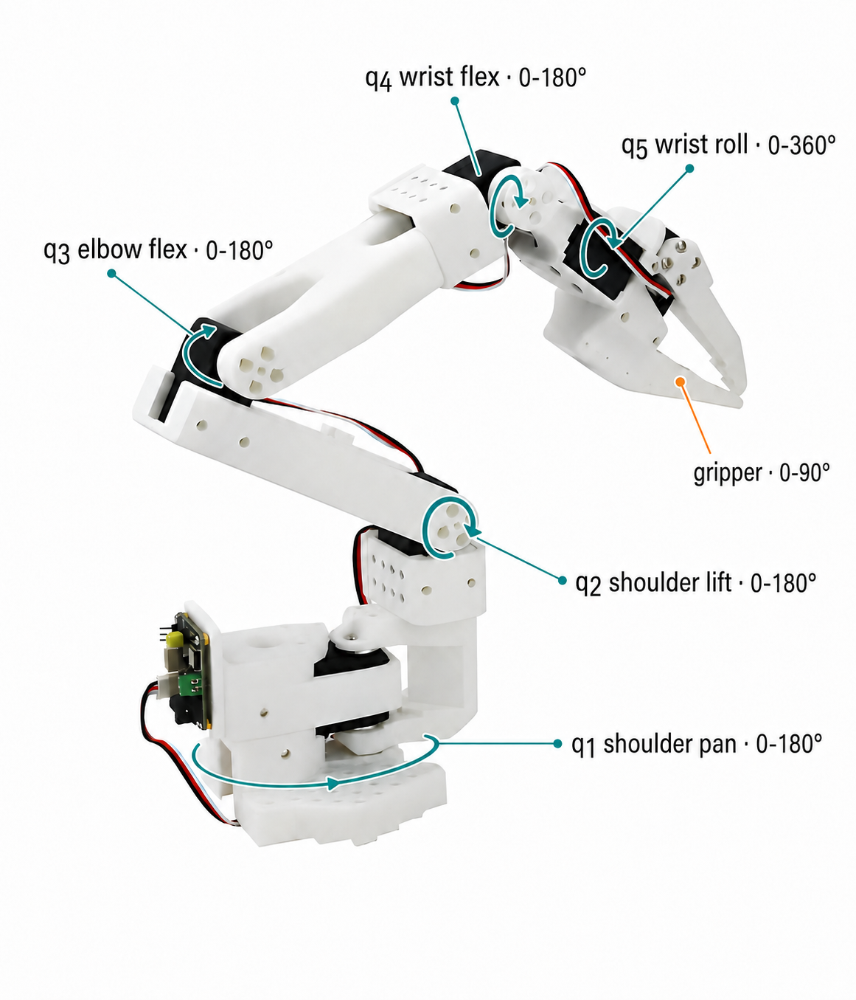

[Part I](/blog/robot-kinematics-coordinate-frames-so3-se3/) established the geometric language of coordinate frames, rotations in \(SO(3)\), and rigid transforms in \(SE(3)\). We can now use that language to connect a robot's joint configuration to the pose of its end-effector.

This relationship can be studied in two directions. Forward kinematics computes the end-effector pose from known joint values. Inverse kinematics computes joint values that achieve a desired pose. The latter is sometimes described informally as backward kinematics, but inverse kinematics is the standard term.

## Configuration Space

Consider a serial robot with \(n\) joints. Its configuration is collected in a joint vector

\[
q = \begin{bmatrix}q_1 & q_2 & \cdots & q_n\end{bmatrix}^{\top}.
\]

For a revolute joint, \(q_i\) is an angle; for a prismatic joint, it is a displacement. The configuration vector does not directly describe where the end-effector is in Cartesian space. Kinematics provides the mapping between these two representations.

Let \(T_{BE}\in SE(3)\) denote the end-effector pose in the robot base frame. The forward and inverse problems can be summarized as

\[
\text{forward:}\quad q \longmapsto T_{BE}(q),
\]

\[
\text{inverse:}\quad T_{BE}^{*} \longmapsto q^{*}.
\]

The forward map is a function: a fixed configuration determines one end-effector pose. The inverse map is more complicated because a target pose may admit multiple configurations, a single configuration, or no feasible configuration at all.

## From Joint Values to a Transform

The notation \(T_{BE}(q)\) is compact, but it hides an important modeling step: each joint value must first become a rigid transform. A convenient convention is to separate the fixed geometry of a link from the motion introduced by its joint:

\[
T_{i-1,i}(q_i)=T_{i-1,i}^{\mathrm{fixed}}T_i^{\mathrm{joint}}(q_i).
\]

The fixed transform stores quantities such as the joint-axis alignment, link length, and link offset. The joint transform contains the part that changes with \(q_i\).

For a revolute joint whose local axis is \(z\), \(q_i\) is an angle and produces a rotation:

\[
R_z(q_i)=
\begin{bmatrix}
\cos q_i & -\sin q_i & 0 \\
\sin q_i & \cos q_i & 0 \\
0 & 0 & 1
\end{bmatrix},
\qquad
T_i^{\mathrm{rev}}(q_i)=
\begin{bmatrix}
R_z(q_i) & 0 \\
0 & 1
\end{bmatrix}.
\]

For a prismatic joint along the local \(z\)-axis, \(q_i\) is a linear displacement and produces a translation:

\[
t_z(q_i)=\begin{bmatrix}0 & 0 & q_i\end{bmatrix}^{\top},
\qquad
T_i^{\mathrm{pri}}(q_i)=
\begin{bmatrix}
I & t_z(q_i) \\
0 & 1
\end{bmatrix}.
\]

An actual joint axis need not coincide with \(z\). The robot model records the appropriate axis and fixed frame alignment, but the principle is unchanged: a revolute coordinate becomes a rotation, while a prismatic coordinate becomes a translation. Multiplying the resulting \(4\times4\) transforms propagates both quantities through the chain.

## Forward Kinematics

Each joint contributes a transform between two adjacent link frames. For a serial chain, the end-effector pose is obtained by composing these transforms in order:

\[
T_{BE}(q) =
T_{01}(q_1)
T_{12}(q_2)
\cdots
T_{(n-1)n}(q_n).
\]

The product accumulates both the joint motion and the fixed link geometry. Once the joint values and robot dimensions are known, evaluating this expression is direct and deterministic.

### A Planar Two-Link Arm

A two-link planar arm makes the geometry explicit. Let the link lengths be \(l_1\) and \(l_2\), with revolute joint angles \(q_1\) and \(q_2\). Using a rotation followed by a translation along each link, the two adjacent-frame transforms are

\[
T_{01}(q_1)=
\begin{bmatrix}
\cos q_1 & -\sin q_1 & 0 & l_1\cos q_1 \\
\sin q_1 & \cos q_1 & 0 & l_1\sin q_1 \\
0 & 0 & 1 & 0 \\
0 & 0 & 0 & 1
\end{bmatrix},
\]

\[
T_{12}(q_2)=
\begin{bmatrix}
\cos q_2 & -\sin q_2 & 0 & l_2\cos q_2 \\
\sin q_2 & \cos q_2 & 0 & l_2\sin q_2 \\
0 & 0 & 1 & 0 \\
0 & 0 & 0 & 1
\end{bmatrix}.
\]

Their product \(T_{02}(q)=T_{01}(q_1)T_{12}(q_2)\) gives the end-effector transform. Reading its translation column produces

\[
x = l_1\cos q_1 + l_2\cos(q_1+q_2),
\]

\[
y = l_1\sin q_1 + l_2\sin(q_1+q_2),
\]

and its planar orientation is

\[
\phi=q_1+q_2.
\]

These equations show the characteristic structure of forward kinematics: downstream links depend on the accumulated rotation of all upstream joints. The second link is therefore oriented by \(q_1+q_2\), not by \(q_2\) alone.

## Differential Kinematics and the Jacobian

Forward kinematics gives position as a nonlinear function of the joints. For the planar arm, collect the end-effector position into

\[
r(q)=\begin{bmatrix}x(q) & y(q)\end{bmatrix}^{\top}.
\]

Differentiating the position with respect to the joint variables gives the Jacobian:

\[
J(q)=\frac{\partial r}{\partial q}=
\begin{bmatrix}
\dfrac{\partial x}{\partial q_1} & \dfrac{\partial x}{\partial q_2} \\
\dfrac{\partial y}{\partial q_1} & \dfrac{\partial y}{\partial q_2}
\end{bmatrix}.
\]

Substituting the two-link forward-kinematics equations yields

\[
J(q)=
\begin{bmatrix}
-l_1\sin q_1-l_2\sin(q_1+q_2) & -l_2\sin(q_1+q_2) \\
l_1\cos q_1+l_2\cos(q_1+q_2) & l_2\cos(q_1+q_2)
\end{bmatrix}.
\]

The resulting relationship is not \(r=Jq\). Forward kinematics is nonlinear, and the Jacobian itself changes with the current configuration. The exact differential velocity relationship is

\[
\begin{bmatrix}\dot{x} \\ \dot{y}\end{bmatrix}
=J(q)
\begin{bmatrix}\dot{q}_1 \\ \dot{q}_2\end{bmatrix},
\]

or, for a sufficiently small step,

\[
\Delta r\approx J(q)\Delta q.
\]

### From Partial Derivatives to Geometric Columns

The derivative above is often called the analytic construction of the Jacobian: write the forward-kinematics equations and differentiate them with respect to each joint variable. For a revolute joint, the same columns can also be constructed directly from the robot geometry.

Let \(o_i\) be a point on joint \(i\)'s rotation axis, \(a_i\) its unit axis direction, and \(o_E\) the end-effector origin. All three are expressed in the robot base frame. If only joint \(i\) moves, the resulting end-effector velocity is described by

\[
J_i(q)=
\begin{bmatrix}
a_i\times(o_E-o_i) \\
a_i
\end{bmatrix}.
\]

The upper block is linear velocity; the lower block is angular velocity. In other words, one column describes the instantaneous end-effector motion produced by one unit of velocity at one joint.

For the planar two-link arm, both joints rotate about the same out-of-plane axis,

\[
a_1=a_2=
\begin{bmatrix}0&0&1\end{bmatrix}^{\top}.
\]

Their origins and the end-effector position are

\[
o_1=
\begin{bmatrix}0\\0\\0\end{bmatrix},
\qquad
o_2=
\begin{bmatrix}l_1\cos q_1\\l_1\sin q_1\\0\end{bmatrix},
\qquad
o_E=
\begin{bmatrix}x\\y\\0\end{bmatrix}.
\]

Applying the cross-product rule gives

\[
\left[a_1\times(o_E-o_1)\right]_{xy} =
\begin{bmatrix}
-l_1\sin q_1-l_2\sin(q_1+q_2)\\
l_1\cos q_1+l_2\cos(q_1+q_2)
\end{bmatrix},
\]

\[
\left[a_2\times(o_E-o_2)\right]_{xy} =
\begin{bmatrix}
-l_2\sin(q_1+q_2)\\
l_2\cos(q_1+q_2)
\end{bmatrix}.
\]

These are exactly the first and second columns obtained from \(\partial r/\partial q\). The two formulas therefore describe the same local mapping: differentiation constructs it from equations, while the geometric form constructs it from joint axes and lever arms. The geometric form becomes especially convenient for a spatial robot such as SO-101.

### SO-101 as a Concrete Robot Example

We can now apply both forward and differential kinematics to the [SO-101 robot from my previous build note](/blog/building-a-dual-arm-so-101-pipeline/). It has five revolute arm joints followed by a gripper actuator, so the configuration used to compute the rigid pose of the gripper frame is

<figure class="article-figure-medium">
  
  <figcaption>Figure 1. The five SO-101 arm joints control the gripper frame's rigid pose. The gripper actuator controls opening and is not an additional pose degree of freedom.</figcaption>
</figure>

\[
q_{\mathrm{arm}}=
\begin{bmatrix}
q_{\mathrm{shoulder\_pan}} &
q_{\mathrm{shoulder\_lift}} &
q_{\mathrm{elbow\_flex}} &
q_{\mathrm{wrist\_flex}} &
q_{\mathrm{wrist\_roll}}
\end{bmatrix}^{\top}.
\]

Calibration converts the servo readings into these joint coordinates, while the robot model supplies the joint axes and link offsets. Forward kinematics evaluates \(T_{BE}(q_{\mathrm{arm}})\). Differential kinematics then relates the five joint velocities to the gripper frame's linear and angular velocity through a \(6\times5\) geometric Jacobian:

\[
\begin{bmatrix}v \\ \omega\end{bmatrix}
=J_{\mathrm{SO\text{-}101}}(q_{\mathrm{arm}})\dot q_{\mathrm{arm}},
\qquad
J_{\mathrm{SO\text{-}101}}\in\mathbb{R}^{6\times5}.
\]

Here, \(v\in\mathbb{R}^3\) is the gripper's linear velocity and \(\omega\in\mathbb{R}^3\) is its angular velocity. Forward kinematics supplies the five joint origins \(o_i\), the five base-frame axis directions \(a_i\), and the gripper origin \(o_E\). Substituting each triplet into the geometric expression above produces one column of \(J_{\mathrm{SO\text{-}101}}\).

For example, suppose the base-yaw joint rotates about the vertical axis, so \(a_1=[0,0,1]^{\top}\), and the gripper is displaced from that axis by \(o_E-o_1=[r_x,r_y,r_z]^{\top}\). Its linear-velocity contribution is

\[
a_1\times(o_E-o_1)=
\begin{bmatrix}-r_y & r_x & 0\end{bmatrix}^{\top}.
\]

The result \([-r_y,r_x,0]^{\top}\) is perpendicular to the radial direction \([r_x,r_y,0]^{\top}\). This is the expected tangential motion when the base rotates. The other four columns follow the same construction using the axes marked in Figure 1. Because upstream rotations move the downstream axes and origins, the Jacobian must be recomputed as \(q\) changes.

More generally, an arm with \(n\) pose-controlling joints has \(J(q)\in\mathbb{R}^{6\times n}\). SO-101 has \(n=5<6\), so it is underactuated with respect to an arbitrary 6-DoF end-effector twist: it cannot independently realize every combination of three-dimensional translation and three-dimensional rotation. A full-rank six-joint arm has \(n=6\). A seven-joint arm has \(n=7>6\) and is kinematically redundant, meaning that multiple joint motions can produce the same end-effector motion. That extra freedom can adjust elbow posture, avoid joint limits, or maintain clearance while preserving the primary task. The SO-101 gripper opening is a separate actuator coordinate and does not add another dimension to the rigid pose of the gripper frame.

How to solve these different Jacobian shapes is a topic of its own. The next note will cover left and right pseudoinverses, redundancy, null-space motion, and singularities in detail.

## Inverse Kinematics

Inverse kinematics starts with a desired end-effector pose and asks which joint configuration can produce it. For the planar arm, suppose the target position is \((x,y)\). Define

\[
c_2 = \frac{x^2+y^2-l_1^2-l_2^2}{2l_1l_2}.
\]

The second joint angle can then be recovered as

\[
q_2 = \operatorname{atan2}\!\left(\pm\sqrt{1-c_2^2},c_2\right),
\]

followed by

\[
q_1 = \operatorname{atan2}(y,x)-\operatorname{atan2}\!\left(l_2\sin q_2,l_1+l_2\cos q_2\right).
\]

The \(\pm\) term produces the familiar elbow-up and elbow-down solutions. Both configurations reach the same point, illustrating why inverse kinematics is generally not a one-to-one mapping.

The reachability condition appears directly in the equation for \(c_2\). A real-valued solution requires

\[
|c_2|\leq1,
\]

which is equivalent to requiring the target to lie within the annular workspace of the two-link arm:

\[
|l_1-l_2|\leq\sqrt{x^2+y^2}\leq l_1+l_2.
\]

## Why Inverse Kinematics Is Harder

Closed-form solutions are available for some robot geometries, but inverse kinematics becomes more difficult as the mechanism and task constraints become more complex. A target may be unreachable, several configurations may realize the same pose, and joint limits or collisions may invalidate an otherwise correct geometric solution. Near a singular configuration, a small Cartesian motion may also require a very large joint change.

These properties mean that an IK solver must do more than invert the forward-kinematics equations. It must choose a feasible solution that is appropriate for the current robot state and task. Numerical solution methods are deferred to the next note.

## Connection to VLA Control

Kinematics also provides a useful bridge between a vision-language-action model and the physical robot. The exact bridge depends on the policy's action representation. Some VLA policies output joint-space targets directly; others output a task-space change in the end-effector pose.

A task-space action can be represented schematically as

\[
a_t^{\mathrm{task}}=
\begin{bmatrix}
\Delta p_t & \Delta\theta_t & \Delta g_t
\end{bmatrix},
\]

where \(\Delta p_t\in\mathbb{R}^3\) is a position change, \(\Delta\theta_t\in\mathbb{R}^3\) is a local orientation update such as an axis-angle vector, and \(\Delta g_t\) commands the gripper. The task-space portion updates a desired end-effector pose \(T_{BE}^{*}\), which must then be converted into joint targets before the motors can execute it:

\[
\text{images, language, robot state}
\longrightarrow
\text{VLA}
\longrightarrow
T_{BE}^{*}
\longrightarrow
\text{IK}
\longrightarrow
q^{*}
\longrightarrow
\text{joint controller}.
\]

For an underactuated arm such as SO-101, a task-space command may request a motion that the mechanism cannot reproduce exactly. The kinematic layer must then preserve the most important part of the command, often prioritizing position while relaxing some orientation error. For a redundant arm, the same layer has extra freedom to satisfy secondary objectives without changing the requested end-effector motion. The next note will develop the pseudoinverse, null-space, and singularity tools needed to make these choices explicit.

If a VLA instead predicts \(q^{*}\) directly, the explicit IK stage disappears from the execution path. Forward kinematics and the Jacobian are still useful for measuring Cartesian behavior, enforcing workspace limits, and checking whether a joint-space action produces the intended end-effector motion.

## Takeaway

Forward kinematics is not a black-box jump from \(q\) to \(T(q)\). Each joint coordinate first becomes a revolute or prismatic transform, and the serial product combines those transforms with the robot's fixed link geometry. The Jacobian is the derivative of this nonlinear map and explains how robot morphology changes the available instantaneous motion.

Inverse kinematics uses the same model in the opposite direction, but it is not a simple matrix inverse. This distinction becomes especially important when a learned policy operates in task space: kinematics is the interface that turns a desired end-effector action into motion the physical joints can execute.
