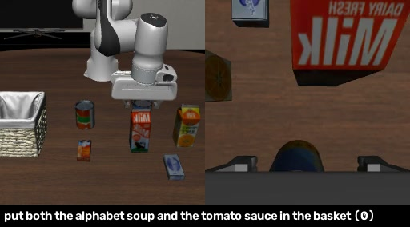
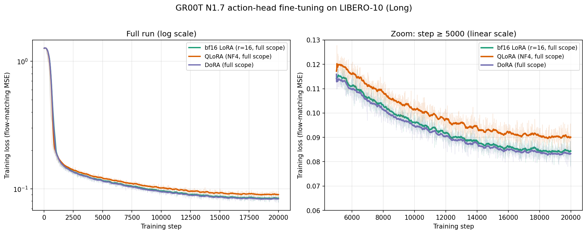
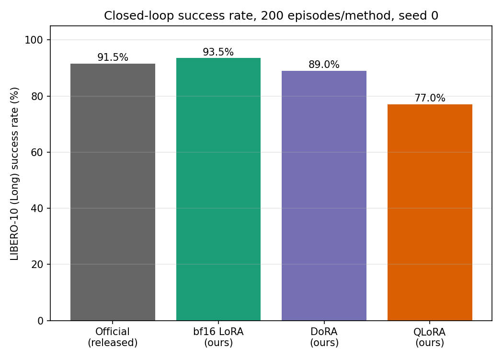

In the generic GR00T checkpoint, the selected embodiment projector slice is frozen at random initialization and receives a low-rank update.

This note studies parameter-efficient adaptation of GR00T N1.7 under one controlled setting: LIBERO-10 Long. The question is not whether one adapter family is universally best, but whether LoRA, QLoRA, and DoRA can be compared meaningfully when they share an identical action interface, training budget, and closed-loop evaluation protocol.

The central architectural issue is that GR00T's embodiment-conditioned state/action projector is both outside ordinary PEFT's `nn.Linear` target rules and, for the generic checkpoint used here, not a pretrained robot-specific map. A valid comparison therefore requires adapting the shared policy and establishing a usable target-embodiment interface at the same time. Under this configuration, rank-16 bf16 LoRA reached 187/200 successes while training 0.79% of model parameters.

For the general mathematics of LoRA, QLoRA, DoRA, and QDoRA, see [Parameter-Efficient Fine-Tuning](/blog/parameter-efficient-fine-tuning/). Here the focus is what those methods mean inside a VLA policy, what was actually adapted, and which conclusions the experiments support.

## Experimental Scope

GR00T N1.7 is an open VLA model whose policy combines visual-language features with a continuous-action diffusion-transformer head [1]. The project uses two datasets with deliberately different roles.

  <figure>
    

      
    

    <figcaption>Figure 1a. LIBERO-10 Long: controlled, multi-stage simulated manipulation.</figcaption>
  </figure>
  <figure>
    

      
    

    <figcaption>Figure 1b. carrot-52: third-person and wrist-camera views from a real-robot demonstration.</figcaption>
  </figure>

LIBERO-10 Long is the controlled evaluation setting. It contains ten multi-stage manipulation tasks, such as placing several objects or completing a sequence around a kitchen workspace. Each evaluation uses 20 closed-loop episodes for each of the ten tasks: 200 episodes total, fixed seed, an 8-step action-chunk execution horizon, and a 720-step timeout.

SO-101 carrot-52 contains 52 teleoperated carrot-to-box demonstrations, 27,209 frames, a fixed third-person camera, and a wrist camera. It is used to validate the data and embodiment interface in [Building a Robot Learning Pipeline with SO-101 · Part II](/blog/building-a-dual-arm-so-101-post-training/). Because it does not yet have a closed-loop hardware evaluation, it is not included in the LIBERO method comparison.

## The Data Interface Is Part of Post-Training

The model cannot use a new robot dataset solely because its action vector has the right length. Its state, action, image keys, camera roles, embodiment category, and storage format must agree with the policy's modality configuration. Post-training begins before optimization: the model can only learn the meanings that its data interface preserves.

The GR00T repository supplies different modality definitions for LIBERO and SO-101. The LIBERO configuration names an 8D state (Cartesian pose plus two gripper-state coordinates), a 7D action (Cartesian pose and gripper channels), and two camera streams. The SO-101 configuration instead groups five arm coordinates and one gripper coordinate in both state and action.

<table>
  <thead>
    <tr><th>Modality</th><th>LIBERO configuration</th><th>SO-101 configuration</th></tr>
  </thead>
  <tbody>
    <tr>
      <td>State</td>
      <td><code>x</code>, <code>y</code>, <code>z</code>, <code>roll</code>, <code>pitch</code>, <code>yaw</code>: [0:6); <code>gripper</code>: [6:8)</td>
      <td><code>single_arm</code>: [0:5); <code>gripper</code>: [5:6)</td>
    </tr>
    <tr>
      <td>Action</td>
      <td><code>x</code>, <code>y</code>, <code>z</code>, <code>roll</code>, <code>pitch</code>, <code>yaw</code>: [0:6); <code>gripper</code>: [6:7)</td>
      <td><code>single_arm</code>: [0:5); <code>gripper</code>: [5:6)</td>
    </tr>
    <tr>
      <td>Video roles and original keys</td>
      <td><code>image</code> → <code>observation.images.image</code> <code>wrist_image</code> → <code>observation.images.wrist_image</code></td>
      <td><code>front</code> → <code>observation.images.front</code> <code>wrist</code> → <code>observation.images.wrist</code></td>
    </tr>
    <tr>
      <td>Task annotation</td>
      <td><code>human.action.task_description</code> → <code>task_index</code></td>
      <td><code>human.task_description</code> → <code>task_index</code></td>
    </tr>
  </tbody>
</table>

The SO-101 file defines the <em>roles</em> `front` and `wrist`; it does not guarantee that every SO-101 dataset uses those literal storage keys. For carrot-52, the abstract roles were mapped to `observation.images.third_view` and `observation.images.left_wrist` after inspecting the recorded streams. That dataset-specific mapping, LeRobot format conversion, and the `new_embodiment` category are described in [Building a Robot Learning Pipeline with SO-101 · Part II](/blog/building-a-dual-arm-so-101-post-training/).

## What LoRA Must Reach in GR00T

The PEFT article treats a frozen linear layer as a base map plus a low-rank update. That abstraction is still useful here, but it hides a robot-specific complication. GR00T's action head includes a category-specific linear layer, with one weight matrix for each embodiment category. Given input tokens <em>x</em> and category identifier <em>e</em>, its operation is schematically

\[
y=xW_e+b_e.
\]

The category selects the state/action projection appropriate to a robot family. A standard PEFT target-module search recognizes ordinary `nn.Linear` layers, but this layer is implemented as a batched matrix multiplication over a tensor of per-category weights. It will be skipped unless it receives a custom adapter.

The relevant structure is conceptually the following. The category index selects a different matrix for every element of a batch, rather than calling one shared `nn.Linear` module:

  
Show the embodiment-conditioned linear layer

  <pre><code>class CategorySpecificLinear(nn.Module):
  def __init__(self, num_categories, input_dim, hidden_dim):
    super().__init__()
    self.W = nn.Parameter(0.02 * torch.randn(
      num_categories, input_dim, hidden_dim
    ))
    self.b = nn.Parameter(torch.zeros(num_categories, hidden_dim))
  def forward(self, x, category_ids):
    selected_W = self.W[category_ids]
    selected_b = self.b[category_ids]
    return torch.bmm(x, selected_W) + selected_b.unsqueeze(1)</code></pre>

This is why targeting only familiar layer names such as `to_q`, `to_k`, `to_v`, and MLP projections is incomplete: those rules see the Transformer but not the per-embodiment action interface.

### The generic checkpoint does not make this projector pretrained

The generic `groot_n1.7_3b` checkpoint used here is different from NVIDIA's separately released LIBERO-specialized checkpoint. Its category-specific projector slices, including the `libero_sim` slice, retain the layer's random initialization rather than a learned projection for that robot. The projector has 32 category slots; the relevant mapping includes a dedicated LIBERO slot and a generic fallback slot for newly configured embodiments:

  
Show the relevant embodiment-category mapping

  <pre><code>_PROJECTOR_INDEX_GROUPS = {
  2: {"libero_sim"},
  10: {
    "new_embodiment",
    "robocasa_panda_omron",
    "robocasa_gr1_tabletop",
  },
}</code></pre>

LIBERO uses slot 2. The SO-101 configuration uses `new_embodiment`, which resolves to slot 10. That fallback slot is shared at the configuration level with unrelated embodiments, so it should be treated as a local fine-tuning interface—not as an identifier that semantically describes the SO-101. During a single-embodiment run, the selected slot is consistent; a joint multi-embodiment run would need more deliberate category design.

This creates two different parameter regimes inside one “full-scope LoRA” run. The action-DiT and visual-language self-attention layers are shared pretrained layers receiving a conventional low-rank fine-tuning update. The selected projector slice is frozen random initialization plus a low-rank adapter: it is effectively learning a compact target-embodiment map from scratch. That distinction is essential when interpreting both the method and its transfer claims.

The final adaptation scope therefore has three pieces:

1. the action-DiT and visual-language self-attention blocks, where conventional PEFT can wrap the attention and MLP linear layers;
2. the embodiment-conditioned state/action projector, where a custom adapter applies the update for the selected category;
3. the visual-language layer normalization (VLLN), which remains fully trainable rather than low-rank adapted.

For the selected category <em>e</em>, let <em>W</em>e0 denote the frozen slice from the generic checkpoint. It remains random at the start of post-training. The adapter is not created by an incidental training effect; the effective projector is defined from the outset as

\[
W_e^{\mathrm{eff}}=W_e^0+\Delta W_e,
\qquad
\Delta W_e=\mathrm{scaling}\cdot
\mathrm{lora\_A}_e\mathrm{lora\_B}_e.
\]

Equivalently, the layer output is

\[
y=xW_e^0+b_e+
x\bigl(\mathrm{scaling}\cdot
\mathrm{lora\_A}_e\mathrm{lora\_B}_e\bigr).
\]

The `lora_A` factor maps the input into an <em>r</em>-dimensional adapter space and `lora_B` maps it back to the output. `lora_A` is randomly initialized and `lora_B` starts at zero, so the adapter update begins at zero while the frozen base slice remains random. This is the complete chain for both LIBERO slot 2 and SO-101 slot 10: the low-rank increment is directly added to the selected frozen random embodiment weight.

The custom wrapper mirrors PEFT's no-op initialization while retaining the category index during both low-rank multiplications:

  
Show the custom projector LoRA adapter

  <pre><code>class LoRACategorySpecificLinear(nn.Module):
  def __init__(self, base, rank, alpha, dropout=0.0):
    super().__init__()
    self.base = base.requires_grad_(False)
    self.scaling = alpha / rank
    n, d_in, d_out = base.W.shape
    self.lora_A = nn.Parameter(torch.empty(n, d_in, rank))
    self.lora_B = nn.Parameter(torch.zeros(n, rank, d_out))
    self.dropout = nn.Dropout(dropout)
    nn.init.kaiming_uniform_(self.lora_A, a=5**0.5)
  def forward(self, x, category_ids):
    base_output = self.base(x, category_ids)
    A = self.lora_A[category_ids]
    B = self.lora_B[category_ids]
    update = torch.bmm(torch.bmm(self.dropout(x), A), B)
    return base_output + self.scaling * update</code></pre>

The resulting methodological requirement is precise: a DiT-only adapter touches ordinary Transformer layers but leaves the selected embodiment interface as frozen random weights. It is therefore not an appropriate primary configuration for evaluating GR00T adaptation to that embodiment. “LoRA on GR00T” is underspecified unless its adaptation scope is stated.

The launch interface exposes the LoRA-family choice as small additions to one common fine-tuning command:

  
Show the LoRA-family launch arguments

  <pre><code>--use_action_lora \
--action_lora_scope full \
--action_lora_rank 16 \
--action_lora_alpha 32 \
--action_lora_dropout 0.05
# QLoRA adds: --use_qlora --qlora_quant_type nf4
# DoRA adds:  --use_dora</code></pre>

## LIBERO: A Controlled Comparison of the LoRA Family

All methods used the same base and task recipe. The variables below define the shared experimental setting.

| Setting | Value |
| --- | --- |
| Base model | GR00T N1.7-3B generic checkpoint |
| Task suite | LIBERO-10 Long |
| Optimization | 20,000 steps; cosine schedule; 5% warmup; learning rate 1e-4 |
| Effective batch size | 640: global batch 320 with two accumulation steps |
| Adapter | rank 16; alpha 32; dropout 0.05; full adaptation scope |
| Precision | bf16; QLoRA uses an NF4 4-bit frozen base with bf16 compute |
| Hardware | Four NVIDIA RTX GPUs with 49G |

Evaluation ran in a dedicated LIBERO client virtual environment through `rollout_policy.py`. To make stochastic action generation reproducible, every policy-action call received a deterministic seed derived from `blake2b(seed:env_idx:episode_idx:call_idx)`, where `seed` is the evaluation seed, `env_idx` identifies the parallel environment, `episode_idx` the rollout, and `call_idx` the action-query count within that rollout. The digest is converted to the integer seed used by the policy sampler.

This replaces the default behavior in which episodes advance one shared random-number-generator stream. With a shared stream, an additional draw in one rollout—or a different ordering of parallel environments—changes the random state consumed by later rollouts. The keyed construction makes each action query independent of those scheduling details: the same evaluation seed and indices reproduce the same sampled action, and one episode cannot perturb another episode's randomness. The identical indexed seed schedule was used for every method in the paired comparison.

<figure class="article-figure-wide">
  
  <figcaption>Figure 2. Flow-matching training loss on LIBERO-10 Long. QLoRA converges to a visibly higher loss floor than bf16 LoRA and DoRA; this is suggestive rather than a closed-loop result by itself.</figcaption>
</figure>

The curves show bf16 LoRA and DoRA reaching a similar training-loss range around 0.08–0.085, while QLoRA remains nearer 0.09 after step 5,000. Training loss is not a control metric: it evaluates demonstrated trajectories, whereas a policy must also respond to states induced by its own rollout. Closed-loop evaluation is therefore the primary outcome.

<figure class="article-figure-wide">
  
  <figcaption>Figure 3. Closed-loop success over 200 matched LIBERO-10 Long episodes per method. bf16 LoRA achieved the highest measured rate in this comparison.</figcaption>
</figure>

| Method | Trainable parameters | Adapter size | Closed-loop success | Paired comparison to bf16 LoRA |
| --- | ---: | ---: | ---: | --- |
| bf16 LoRA | 0.79% | 50 MB | 187/200 (93.5%) | — |
| DoRA | about 0.82% | 51 MB | 178/200 (89.0%) | McNemar <em>p</em> = 0.136 |
| QLoRA | 0.79% | 50 MB | 154/200 (77.0%) | McNemar <em>p</em> = 2.5 × 10−7 |

The McNemar test uses the same 200 initial states for every method. In this configuration, QLoRA is lower than bf16 LoRA with a statistically significant paired-rollout difference. DoRA is lower than bf16 LoRA, but the paired-rollout test does not establish a difference at conventional significance. These tests condition on one trained checkpoint per method; they do not estimate variation across independent training seeds. Multi-seed training is required before interpreting the comparison as a stable method ranking.

There is no fair dense Long baseline in this comparison. A dense run exists for a different LIBERO suite under the matched recipe, and a Long dense run exists with a much smaller effective batch. Neither is a like-for-like reference. The supported conclusion is narrower: full-scope bf16 LoRA is highly effective for this GR00T/LIBERO recipe; these data do not prove equivalence to dense fine-tuning on Long.

<figure class="article-figure-wide">
  <video controls playsinline preload="metadata">
    <source src="libero_long_task00_success.mp4" type="video/mp4">
  </video>
  <figcaption>Figure 4. A successful bf16-LoRA rollout on a LIBERO-10 Long task.</figcaption>
</figure>

## SO-101: Complementary Interface Validation

The LIBERO comparison establishes the controlled, closed-loop result. The SO-101 carrot-52 run serves a different purpose: it verifies that the same adaptation path can consume a real teleoperation dataset after its camera roles, state/action modalities, and `new_embodiment` configuration have been specified. Its trainer-reported loss reaches 0.0391.

  <figure>
    
    <figcaption>Figure 5. Trainer-reported loss for the SO-101 carrot-to-box fine-tuning run, ending near 0.039.</figcaption>
  </figure>
  <figure>
    <video controls playsinline preload="metadata">
      <source src="so101_carrot52_demo_episode0.mp4" type="video/mp4">
    </video>
    <figcaption>Figure 6. An episode from carrot-52.</figcaption>
  </figure>

This is not a hardware-policy result: no repeated closed-loop SO-101 evaluation has yet been run. The dataset conversion, modality mapping, training configuration, and the corresponding limitations are documented in [Building a Robot Learning Pipeline with SO-101 · Part II](/blog/building-a-dual-arm-so-101-post-training/).

## Practical Constraints of the LoRA Family

The experiments also expose constraints that apply beyond one training run.

Quantization changes numerical failure modes. In this setup, loading the quantized base without an explicit bf16 dtype left some components in fp16. The run produced a plausible decreasing log while the saved adapter tensors were NaN. The training logger's NaN filter hid the failure in aggregate loss. Explicit `torch.bfloat16` on training and evaluation load paths fixed it. The reusable check is simple: inspect saved adapter tensors, not only the loss curve.

DoRA trades efficiency for a more expressive update. It used roughly 8 GB more memory per GPU and about 30% more wall-clock time than bf16 LoRA here. Controlled measurements traced most of the cost to the native DoRA path for conventional linear layers rather than the custom projector adapter. With nonzero adapter dropout, the implementation recomputes a base-layer forward pass; the magnitude path also retains activations that plain LoRA does not need. DoRA is an expressiveness choice, not a free replacement for LoRA.

## Limitations and Takeaways

The result is intentionally narrow. It evaluates one benchmark suite, one training configuration, and one trained checkpoint per adaptation method. It does not include a dense fine-tuning baseline under the same LIBERO-10 Long recipe, a held-out task distribution, or multiple independent training seeds. The reported paired-rollout statistics therefore support a comparison among the evaluated checkpoints, not a general ordering of LoRA, QLoRA, and DoRA.

Within that scope, three conclusions are supported. First, a full-scope bf16 LoRA configuration can obtain strong closed-loop performance with a small trainable fraction of GR00T N1.7. Second, the target-module specification is part of the method: the embodiment projector cannot be omitted. Third, quantization and magnitude-direction adaptation should be evaluated as distinct systems-level choices, not assumed to be uniformly better variants of LoRA.

## References

1. NVIDIA, J. Bjorck, F. Castañeda, N. Cherniadev, X. Da, R. Ding, et al. [*GR00T N1: An Open Foundation Model for Generalist Humanoid Robots*](https://arxiv.org/abs/2503.14734). arXiv:2503.14734, 2025.
