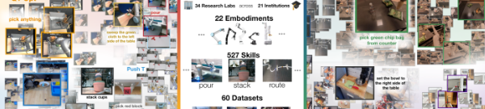
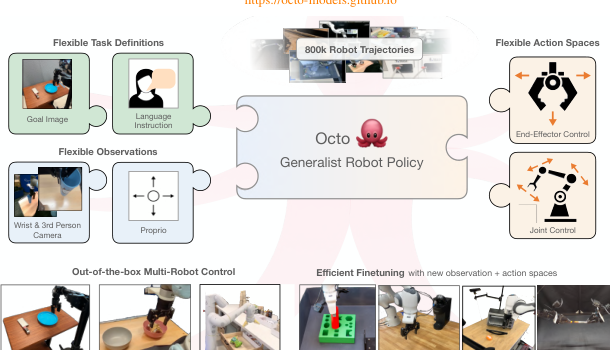
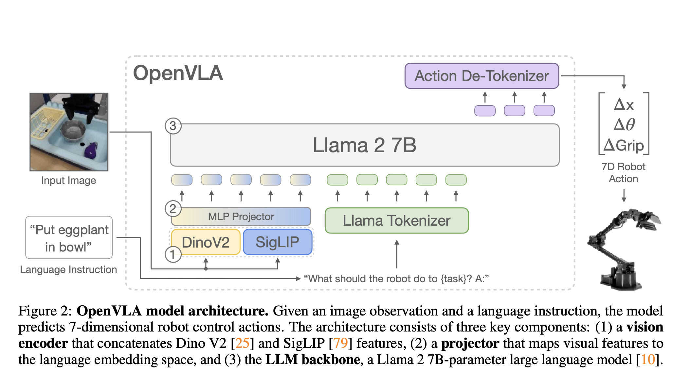
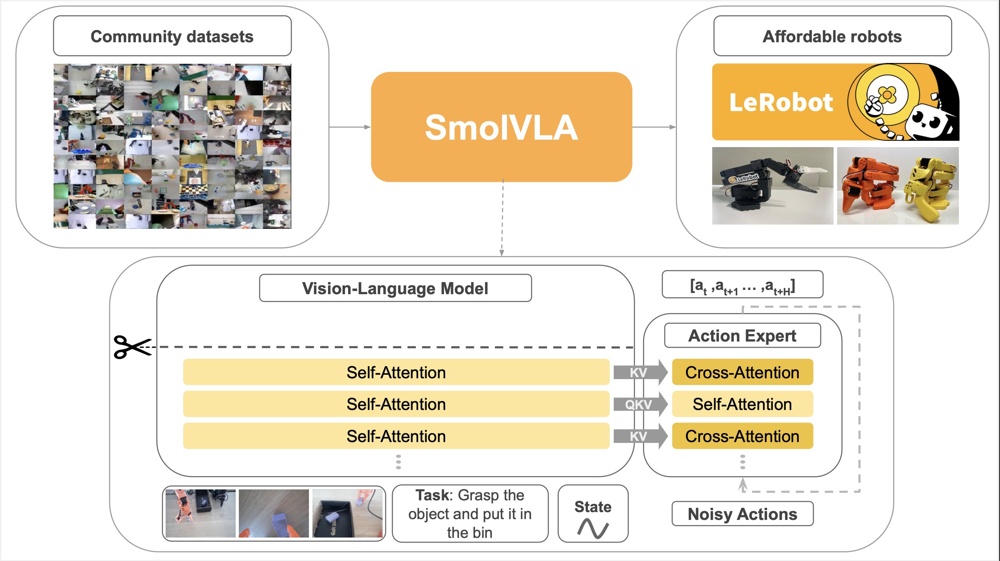

Why a policy trained on many robots is not simply a policy trained on more data.

Part I treated the robot interface as fixed. An observation went into a policy; the policy produced an action chunk in one known action space. That framing is enough to understand ACT, diffusion, and flow matching. It breaks as soon as demonstrations come from different robots. One dataset may contain wrist cameras and end-effector deltas; another may contain no wrist camera, joint positions, and a different gripper. Pooling them is useful only if a model can tell what is shared and what is specific to each embodiment.

This note follows that problem from data to policy. Open X-Embodiment provides a common way to package heterogeneous robot experience. RT-X asks whether joint training on that experience helps. Octo, OpenVLA, and SmolVLA are three open answers to a further question: what should a reusable policy look like? CALVIN and LIBERO then clarify what a reported result is actually measuring.

## The Interface That Stops Being Fixed

For one robot, a demonstration trajectory can be written as

\[
\tau=\{(o_t,g,a_t)\}_{t=1}^{T}.
\]

The observation <em>o</em>t may contain images and proprioception, <em>g</em> is a task description, and <em>a</em>t is a command. In a multi-robot collection, every trajectory also belongs to an embodiment <em>e</em>:

\[
\mathcal D=\bigcup_{e\in\mathcal E}\mathcal D_e,
\qquad
\mathcal D_e=\{(o_t^{(e)},g_t^{(e)},a_t^{(e)})\}.
\]

The superscript does real work. The dimensions and meanings of both observation and action can change with <em>e</em>. A 7-DoF arm with a wrist camera does not expose the same information or accept the same command as a bimanual robot with two grippers. Even two actions with the same dimension may use different coordinate frames, control frequencies, or gripper conventions.

The desired policy is therefore better written as

\[
\pi_\theta\!\left(A_t^{(H)}\mid o_{\leq t}^{(e)},g,e\right),
\]

where <em>A</em>t(H) is the horizon-<em>H</em> action chunk from Part I. The embodiment label need not be a literal one-hot vector supplied to the network. In practice it is represented through modality-specific encoders, action heads, normalization choices, and fine-tuned parameters. The notation simply makes the requirement explicit: the policy must not mistake different physical interfaces for identical data.

A common dataset format solves bookkeeping, not embodiment. It can state which image, state, instruction, and action belong to a time step. It cannot by itself make a joint-angle command on one arm semantically equivalent to an end-effector delta on another. That distinction is the starting point for Open X.

## Open X-Embodiment and RT-X: Make Joint Training Possible

Open X-Embodiment collects robot-learning datasets from many institutions into a standardized trajectory format and pairs them with RT-X models [1]. Its contribution is infrastructure as much as a model: heterogeneous demonstrations become loadable, documented, and mixable without every group inventing a separate conversion pipeline.

<figure class="article-figure-wide">
  
  <figcaption>Figure 1. Open X-Embodiment turns datasets from different robots and institutions into a shared training collection; RT-X evaluates whether that diversity transfers across robot setups. Reproduced from [1].</figcaption>
</figure>

RT-1-X and RT-2-X are joint-training variants of the RT family. RT-1-X uses the RT-1 robot-transformer recipe, while RT-2-X extends the vision-language-action direction introduced by RT-2. The suffix <em>X</em> means cross-embodiment training, not that all robots have become mechanically interchangeable. The central empirical claim is narrower: demonstrations from other robots can improve a target robot's behavior when the representation, data processing, and action interface make their regularities accessible [1].

This changes the usual imitation-learning objective from a single dataset average to a mixture over embodiments:

\[
\mathcal L(\theta)=\sum_{e\in\mathcal E} w_e\,\mathbb E_{(o,g,A)\sim\mathcal D_e}\left[-\log \pi_\theta(A\mid o,g,e)\right].
\]

The weight <em>w</em>e says how strongly dataset <em>e</em> contributes. It matters because a large, easy dataset can otherwise dominate a small dataset containing the precise behavior one cares about. The formula also reveals what data standardization does <em>not</em> answer: which examples should be mixed, what command representation is safe to share, and whether the target task is similar enough for transfer.

Open X is best understood as a data and training setting rather than one final policy architecture. It makes the next design question unavoidable: can a policy have a shared core while still accepting new cameras, proprioceptive inputs, and action spaces?

## Octo: A Modular Generalist Policy

Octo [2] is designed around that adaptation problem. It is a Transformer-based diffusion policy pretrained on Open X data. Rather than require every robot to expose the same sensors, Octo uses modules that convert available observations and task specifications into a common token space. A task can be given as language or as a goal image; a robot can provide one or more cameras, a history, and whichever proprioceptive signals are available.

<figure class="article-figure-wide">
  
  <figcaption>Figure 2. Octo separates task and observation tokenization from a shared Transformer core, then generates actions with a diffusion head. Reproduced from [2].</figcaption>
</figure>

At a high level, write the encoders as <em>T</em>e for task inputs and <em>O</em>e for observations. The shared Transformer produces a context:

\[
c_t=F_\theta(T_e(g),O_e(o_{\leq t})).
\]

The action decoder then models a chunk conditionally on that context:

\[
A_t^{(H)}\sim p_\psi(A\mid c_t,e).
\]

For Octo, <em>p</em>ψ is a diffusion action head, so sampling means denoising an action chunk as described in Part I. The key point is architectural, not just probabilistic: the shared core can retain patterns learned from broad data while a new robot gets the encoders, normalization, and action components appropriate to its own interface.

This makes “generalist” more concrete. It does not mean zero-shot success on every unseen robot. Octo was explicitly designed for both out-of-the-box control where the pretraining interface already matches and efficient fine-tuning where new observation or action modalities must be accommodated [2]. Fine-tuning is a feature of the method, not evidence that the pretrained weights alone solve embodiment transfer.

## OpenVLA: Treat Actions as a Language-Model Output

Octo keeps a dedicated diffusion policy head. OpenVLA [3] takes a different route: begin with a large pretrained vision-language model, then make continuous robot actions into output tokens. Its visual encoder produces image-patch features; a projector maps those features into the language model's input space; the language-model backbone predicts action tokens. A decoder converts the tokens back to a command that the robot can execute.

<figure class="article-figure-wide">
  
  <figcaption>Figure 3. OpenVLA maps images and a language instruction into a VLM, which autoregressively predicts discretized action tokens that are decoded into continuous robot commands. Reproduced from [3].</figcaption>
</figure>

For an action vector <em>a</em> with coordinates <em>a</em>j, let <em>Q</em>j map coordinate <em>j</em> to a discrete bin <em>z</em>j. The model learns an autoregressive distribution such as

\[
p_\theta(z_1,\ldots,z_d\mid I,g,q)=\prod_{j=1}^{d}p_\theta(z_j\mid z_{<j},I,g,q),\qquad z_j=Q_j(a_j).
\]

Here <em>I</em> is the image input, <em>q</em> is robot state when included, and <em>d</em> is the action dimension. The notation should not be read as a claim that every implementation predicts one coordinate at a time in exactly this order. It states the modeling idea: actions have been discretized so a language-model-style next-token objective can train the controller.

The gain is that visual and linguistic representations can be inherited from a VLM, while robot behavior becomes another output modality. The cost is quantization and embodiment adaptation. A binning scheme must cover the control range at adequate resolution, and a token sequence still has to be decoded in the target robot's convention. OpenVLA therefore supports parameter-efficient adaptation; its reported LoRA experiments are a practical bridge between a large shared backbone and a local robot setup [3].

There is also an important boundary on the word “generalist.” The OpenVLA project reports that a Diffusion Policy trained from scratch can outperform fine-tuned generalist policies on narrow, single-instruction precision tasks, whereas Open X pretraining helps more on diverse language-conditioned settings [3]. Breadth and specialization are different axes; a larger pretrained model does not automatically dominate a policy trained directly for one exact motion.

## SmolVLA: Ask What Must Be Small and Open

SmolVLA [4] pursues the same broad VLA interface with a much smaller, open model. It combines camera observations, robot state, and language, then uses a vision-language backbone to condition a flow-matching action expert. Its emphasis is practical accessibility: a model small enough to train, fine-tune, and serve in the open LeRobot ecosystem without treating a multi-billion-parameter VLM as the only possible entry point.

<figure class="article-figure-wide">
  
  <figcaption>Figure 4. SmolVLA encodes multi-camera images, robot state, and language in a compact VLM; a flow-matching action expert produces a continuous action chunk. Reproduced from [4, Fig. 2].</figcaption>
</figure>

The separation in Figure 4 is important. The VLM produces contextual features from visual, language, and state tokens; the approximately 100M-parameter action expert then generates a continuous chunk by flow matching. This is the continuous, non-autoregressive action-generator route from Part I, rather than OpenVLA's discretized action-token route. SmolVLA also reduces visual tokens, uses intermediate VLM features, and interleaves cross-attention to VLM context with action self-attention to lower inference cost [4].

The comparison with OpenVLA is useful because the names can obscure the design choice. Both use visual-language context to condition robot actions. OpenVLA casts the robot output as discrete language-model tokens from a 7B VLM; SmolVLA uses a compact VLM plus flow-matching action expert, with deployment engineering such as asynchronous inference as part of the design [3, 4]. Neither label—open, small, or generalist—says enough by itself. The relevant questions are: what observations are encoded, how is action generated, what data trained it, and what must be fine-tuned for the target robot?

## Benchmarks Are Not Datasets, and Datasets Are Not Policies

The terms are often put in one list, but they answer different questions.

| Object | What it provides | The question it can answer | What it cannot establish alone |
| --- | --- | --- | --- |
| Open X-Embodiment / RT-X | Multi-source data format, collection, and joint-training study | Does diverse robot experience help a target setup? | That one architecture is universally best |
| Octo | Open pretrained generalist policy | Can a modular Transformer-diffusion policy adapt across interfaces? | Performance on every embodiment without target data |
| OpenVLA | Open VLM-based action-token policy | Can VLM pretraining support language-grounded robot actions? | That tokenized actions beat diffusion on all control tasks |
| SmolVLA | Compact open VLA | What can a smaller deployable VLA offer? | A scale-independent ranking of all VLAs |
| CALVIN | Language-conditioned long-horizon benchmark | Can a policy complete a sequence of instructions? | Real-world multi-robot transfer |
| LIBERO | Lifelong-learning benchmark suites | Does learning new tasks preserve and transfer prior knowledge? | Physical robustness on real hardware |

CALVIN evaluates language-conditioned long-horizon manipulation: a policy must execute instruction sequences rather than a single isolated command [5]. A useful evaluation statistic is therefore a sequence completion probability, not merely one-step prediction error. If <em>S</em>i indicates success on instruction <em>i</em>, a length-<em>L</em> chain asks for

\[
\Pr(S_1=1,\ldots,S_L=1).
\]

This quantity decays quickly when a policy cannot recover from an earlier failure, which is exactly why it reveals a different capability from a pick-and-place success rate.

LIBERO instead targets knowledge transfer in lifelong robot learning [6]. Its task suites are organized to test whether learning later tasks damages earlier ones, and whether structure learned before helps new tasks. If <em>R</em>i,j is performance on task <em>j</em> after training through task <em>i</em>, then forgetting for an earlier task <em>j</em> can be summarized by

\[
F_j=\max_{i\geq j} R_{i,j}-R_{T,j}.
\]

The first term is the best performance the learner ever achieved on task <em>j</em>; the second is its performance after the full task sequence. A large positive value means the model lost an earlier skill. This is a continual-learning measurement, not a claim about cross-embodiment transfer.

## What Actually Changes From Part I

Part I asked how a policy should generate a plausible action chunk. Part II adds a second layer: <em>whose</em> camera, state, and action chunk are they? ACT, diffusion, and flow matching are action-generation choices. Open X, Octo, OpenVLA, and SmolVLA add choices about dataset conventions, shared representations, and adaptation boundaries.

Three distinctions are worth carrying forward:

1. More data is useful only through an interface. Multi-robot demonstrations need explicit handling of missing sensors, action meanings, normalization, and target adaptation.
2. A generalist policy is not one fixed deployment recipe. It may reuse a shared backbone while changing input modules, output modules, or a small set of parameters for a new robot.
3. Evaluation claims have a scope. CALVIN measures long-horizon instruction following; LIBERO measures lifelong transfer; real-robot Open X evaluations measure a different combination of embodiment, task, and data shift.

The next question is where language-model-scale pretraining changes the policy itself: the RT family makes that transition from robot tokens toward vision-language-action models explicit.

## References

1. Open X-Embodiment Collaboration. [*Open X-Embodiment: Robotic Learning Datasets and RT-X Models*](https://arxiv.org/abs/2310.08864). IEEE International Conference on Robotics and Automation, 2024.
2. Octo Model Team, D. Ghosh, H. Walke, K. Pertsch, K. Black, O. Mees, et al. [*Octo: An Open-Source Generalist Robot Policy*](https://arxiv.org/abs/2405.12213). Robotics: Science and Systems, 2024.
3. M. J. Kim, K. Pertsch, S. Karamcheti, T. Xiao, A. Balakrishna, S. Nair, et al. [*OpenVLA: An Open-Source Vision-Language-Action Model*](https://arxiv.org/abs/2406.09246). arXiv:2406.09246, 2024.
4. Hugging Face. [*SmolVLA: A Vision-Language-Action Model for Affordable and Efficient Robotics*](https://huggingface.co/blog/smolvla). Hugging Face Blog, 2025.
5. O. Mees, L. Hermann, E. Rosete-Beas, and W. Burgard. [*CALVIN: A Benchmark for Language-Conditioned Policy Learning for Long-Horizon Robot Manipulation Tasks*](https://arxiv.org/abs/2112.03227). IEEE Robotics and Automation Letters, 2022.
6. B. Liu, Y. Zhu, C. Gao, Y. Feng, Q. Liu, Y. Zhu, and P. Stone. [*LIBERO: Benchmarking Knowledge Transfer for Lifelong Robot Learning*](https://arxiv.org/abs/2306.03310). Advances in Neural Information Processing Systems Datasets and Benchmarks Track, 2023.
