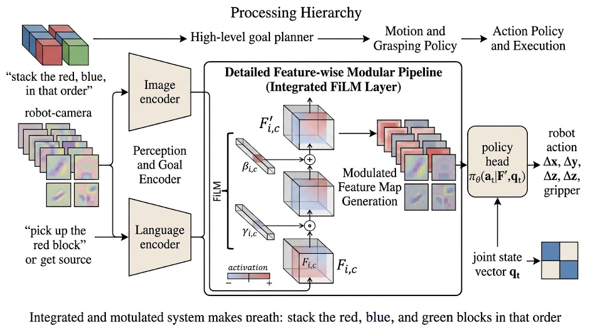
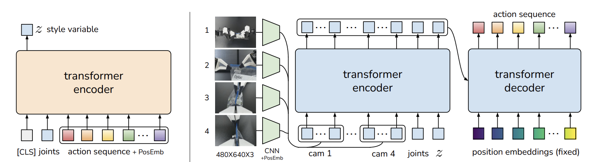
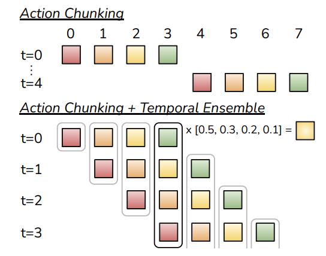
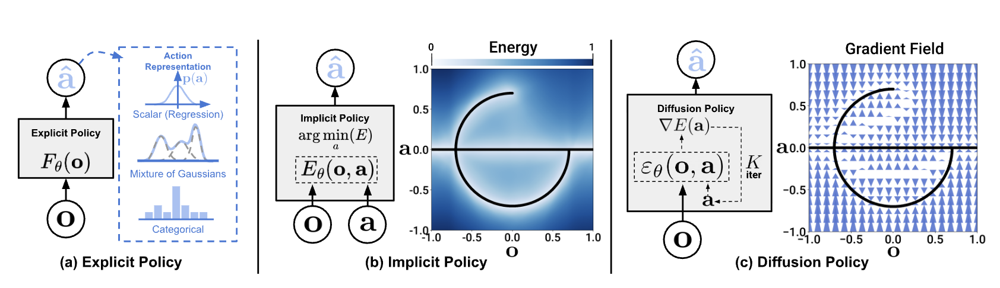

The policy foundations beneath modern vision-language-action systems.

A vision-language-action model is still a robot policy: it must turn what the robot sees, what it is told, and what it knows about its body into a physically meaningful next motion. Before asking how web-scale language knowledge or multi-robot data help, it is useful to understand the action-learning methods that make that last step work.

One observation can admit several good motions. The central question is therefore not only how to predict an action, but what object the policy should represent: a single action, a short action plan, or a distribution over complete action chunks.

## A Common Policy Interface

At control time <em>t</em>, let <em>It</em> denote one or more camera images, <em>qt</em> the robot state, and <em>g</em> a goal or language instruction. Write the observation as

\[
o_t=(I_t,q_t).
\]

An action <em>at</em> may mean joint positions, an end-effector displacement, gripper commands, or mobile-base velocity. Its dimension is <em>d</em>a. A conventional one-step policy is

\[
\pi_\theta(a_t\mid o_{\leq t},g),
\]

where <em>θ</em> are learned parameters and <em>o</em>≤t is either the current observation or a short history.

Many methods instead predict an action chunk of horizon <em>H</em>:

\[
A_t^{(H)}=(a_t,a_{t+1},\ldots,a_{t+H-1})\in\mathbb R^{H\times d_a}.
\]

The robot normally executes only the first action, or a short prefix, then observes again and queries the policy again. Chunking is therefore not a commitment to open-loop control. It gives the policy a local plan while preserving feedback.

## Behavior Cloning: Learn Directly from Demonstrations

Suppose a dataset <em>𝒟</em> contains demonstrated observations, goals, and actions. Behavior cloning learns the demonstrated conditional distribution by maximum likelihood:

\[
\mathcal L_{\mathrm{BC}}
=-\mathbb E_{(o_t,g,a_t)\sim\mathcal D}
\left[\log\pi_\theta(a_t\mid o_t,g)\right].
\]

For a Gaussian policy with fixed variance, minimizing this loss is equivalent to minimizing squared prediction error. Behavior cloning needs demonstrations but no manually designed reward or simulator. It is also the baseline from which the later methods depart.

Its first limitation is distribution shift. A small deployment error produces a state that is absent from the demonstrations. The policy then has to act on an unfamiliar observation, which can cause the next error to grow. Its second limitation is multimodality. If going left and going right are both valid ways to reach an object, a squared-error policy can average them into a motion that reaches neither.

### A longer history helps, but does not choose a trajectory

A sequence policy changes the information available to behavior cloning, rather than the objective itself:

\[
h_t=\operatorname{Transformer}(o_{t-L+1},\ldots,o_t),
\qquad
\hat a_t=f_\theta(h_t,g).
\]

Here <em>L</em> is the history length and <em>ht</em> is a context-dependent feature. Attention can recover information hidden by one image: whether a drawer was already opened, for example, or whether an object is moving. It does not by itself solve action ambiguity. A Transformer can still be trained as a deterministic regressor. The next change therefore concerns the output itself: predict a short plan rather than one action.

### FiLM: make the goal alter perception

FiLM [1] originated in visual reasoning, but it is a useful primitive for goal-conditioned control. Given visual features <em>F</em> and a goal representation <em>g</em>, it applies

\[
\operatorname{FiLM}(F\mid g)=\gamma(g)\odot F+\beta(g).
\]

The functions <em>γ</em> and <em>β</em> produce goal-dependent scale and shift vectors; <em>⊙</em> is element-wise multiplication. The FiLM block in Figure 1 applies the scale channel by channel, then adds the shift, producing the modulated feature map <em>F′</em>. A policy head can combine <em>F′</em> with the robot joint state to predict a concrete action.

<figure class="article-figure-wide">
  
  <figcaption>Figure 1. FiLM as a goal-conditioned visual module within a robot policy. The outer planning and execution arrows show one possible control context; the central scale-and-shift operation is the FiLM mechanism from [1].</figcaption>
</figure>

Thus a command such as “pick up the red block” can change the visual features passed to the action head before an action is predicted. FiLM does not solve data collection or action generation. It isolates a key VLA design problem: how language should reshape visual evidence for control.

## ACT: Predict a Short Coordinated Plan

ACT—Action Chunking with Transformers—was introduced in [2] for precise bimanual manipulation. Its central change is simple: rather than asking the network for one action, ask it for a short coordinated plan.

The paper's ALOHA setup makes the dimensions concrete. It has two arms. Each arm has six rotational joints and one gripper coordinate, so its joint state has seven degrees of freedom; both arms together give

\[
q_t\in\mathbb R^{14}.
\]

The observation also contains four 480 × 640 RGB cameras: one global top view, one front view, and one close-up camera on each wrist. An action is the next desired 14-dimensional joint configuration. If the chunk horizon is <em>k</em>, ACT predicts

\[
A_t^{(k)}=(a_t,a_{t+1},\ldots,a_{t+k-1})
\in\mathbb R^{k\times14}.
\]

The two halves of Figure 2 happen at different times. The left conditional-VAE encoder exists only during training; the right Transformer policy is the component retained for control.

<figure class="article-figure-wide">
  
  <figcaption>Figure 2. ACT's training-time latent encoder (left) and image-conditioned action-chunk policy (right). Adapted from [2, Fig. 3] using the supplied figure.</figcaption>
</figure>

### Training-time CVAE encoder

During training, the encoder sees the current joint state and the demonstrated future chunk, but not the images. Omitting images makes this auxiliary branch cheaper to train; its job is to summarize variation in human action sequences, not to become the deployed visual policy.

The encoder receives three token groups:

\[
\text{[CLS]}\in\mathbb R^{1\times512},
\qquad
e_q(q_t)\in\mathbb R^{1\times512},
\qquad
e_a(A_t^{(k)})\in\mathbb R^{k\times512}.
\]

The learned [CLS] token is prepended to the joint token and the <em>k</em> action tokens. After the BERT-like Transformer encoder, its output vector

\[
h_{\mathrm{CLS}}\in\mathbb R^{512}
\]

is sent through two linear heads to obtain the parameters of a Gaussian posterior:

\[
\boldsymbol\mu=g_\mu(h_{\mathrm{CLS}}),
\qquad
\log\boldsymbol\sigma^2=g_\sigma(h_{\mathrm{CLS}}),
\qquad
q_\phi(z\mid A_t^{(k)},q_t)
=\mathcal N(\boldsymbol\mu,\operatorname{diag}(\boldsymbol\sigma^2)).
\]

Sampling is implemented with the reparameterization trick,

\[
z=\boldsymbol\mu+\boldsymbol\sigma\odot\boldsymbol\epsilon,
\qquad
\boldsymbol\epsilon\sim\mathcal N(0,I).
\]

The latent <em>z</em> represents a style of a demonstrated local motion: for the same state, a human may take slightly different valid paths, especially before the final precise contact.

### Deployed visual action-chunk policy

At deployment, there is no future demonstrated action sequence, so the left encoder cannot be used. The policy instead uses the prior mean, <em>z = 0</em>. Each of the four camera images passes through a ResNet-18 visual encoder. A 480 × 640 image becomes a 15 × 20 × 512 feature map; flattening its spatial locations gives

\[
15\times20\times512
=300\times512
\]

visual tokens per camera. With four cameras, the visual input is 1200 × 512 tokens. ACT adds a 2D sinusoidal positional embedding so that flattening does not discard where a feature came from in an image.

The visual tokens, the projected joint state, and <em>z</em> form the encoder memory:

\[
\underbrace{1200\times512}_{\text{four cameras}}
\; + \;
\underbrace{1\times512}_{\text{joints}}
\; + \;
\underbrace{1\times512}_{z}
\; = \;
1202\times512.
\]

The Transformer decoder uses <em>k</em> fixed positional query embeddings and cross-attends to this memory. Its output is a sequence of <em>k</em> 512-dimensional action tokens,

\[
H_{\mathrm{act}}\in\mathbb R^{k\times512},
\]

which a small MLP maps to the actual robot command:

\[
\hat A_t^{(k)}=\operatorname{MLP}(H_{\mathrm{act}})
\in\mathbb R^{k\times14}.
\]

This is the meaning of action chunking in ACT: predict the next <em>k</em> full bimanual joint targets as one coordinated object, rather than treating every 14-dimensional action independently.

### What the loss is asking for

The policy and training-only encoder are optimized together with

\[
\mathcal L_{\mathrm{ACT}}
=\lVert A_t^{(k)}-\hat A_t^{(k)}\rVert_1
+\beta D_{\mathrm{KL}}\!\left(
q_\phi(z\mid A_t^{(k)},q_t)
\,\middle\|\,
\mathcal N(0,I)
\right).
\]

The reconstruction term is L1, not L2. A large deviation in one noisy human demonstration contributes linearly rather than quadratically, so it cannot dominate the update as strongly as it would under MSE. The ACT paper reports that this choice produced more precise action-sequence modeling [2]. L1 does not mathematically guarantee precision; its practical value here is robustness to imperfect and multimodal human demonstrations.

The KL term keeps the posterior inferred from a demonstration close to the standard normal prior. It prevents the encoder from hiding arbitrary information in <em>z</em>, which is essential because deployment uses <em>z = 0</em> rather than an encoded future action chunk.

### Why absolute joint targets help

ACT's 14 action coordinates are absolute joint positions, not joint increments. A predicted target is therefore expressed in one fixed joint-coordinate system. If the policy is queried again after a small execution error, its new target is still an absolute configuration; the representation does not numerically sum a chain of its own predicted deltas.

This does not eliminate physical error accumulation. Contacts, calibration error, latency, and a missed grasp still require visual feedback. The benefit is narrower and useful: the command representation itself does not recursively integrate prediction errors. Querying a fresh chunk at every control step lets the four-camera observation correct the plan in closed loop.

ACT queries a new chunk at every control step. Several predicted chunks can contain an estimate for the same physical action, so the policy temporally ensembles those estimates:

\[
a_t=\frac{\sum_i w_i\hat a_t^{[t-i]}}{\sum_iw_i},
\qquad w_i=\exp(-mi).
\]

The symbol <em>â</em>t[t−i] means the prediction for time <em>t</em> made at time <em>t−i</em>. The coefficient <em>m</em> determines how rapidly newer predictions dominate. Figure 3 illustrates this: the colored boxes aligned in one column are several predictions for one physical control instant. ACT averages that column, not actions from different moments.

<figure class="article-figure-medium">
  
  <figcaption>Figure 3. ACT first predicts overlapping action chunks, then temporally ensembles predictions for the same physical control instant. Adapted from [2, Fig. 3] using the supplied figure.</figcaption>
</figure>

ACT reduces the effective planning horizon and can coordinate tightly coupled bimanual motion. It remains a demonstration learner for a specific embodiment: it does not by itself provide experience with new objects, recovery states, or a different robot.

## Diffusion Policy: Model the Distribution of Action Chunks

Diffusion Policy [3] changes the output model. Rather than predict one chunk directly, it learns to turn a noisy chunk into a demonstrated chunk, conditional on the observation.

Let <em>A</em>0 be a clean demonstrated action chunk. A forward diffusion process corrupts it at noise level <em>k</em>:

\[
A^k=\sqrt{\bar\alpha_k}A^0
+\sqrt{1-\bar\alpha_k}\,\epsilon,
\qquad \epsilon\sim\mathcal N(0,I).
\]

The schedule is defined by small noise variances <em>β</em>k, with

\[
\alpha_k=1-\beta_k,
\qquad
\bar\alpha_k=\prod_{j=1}^{k}\alpha_j.
\]

Thus <em>α&#772;</em>k is the cumulative signal retained after <em>k</em> noising steps. A neural network receives the noisy chunk, observation, goal, and noise level, then predicts the injected noise:

\[
\mathcal L_{\mathrm{diff}}
=\mathbb E\left[
\lVert\epsilon-\epsilon_\theta(A^k,o_t,g,k)\rVert_2^2
\right].
\]

At execution, the policy starts from Gaussian noise and repeatedly applies reverse denoising steps. Given the current noisy chunk <em>A</em>k, one standard noise-prediction reverse step is

\[
A^{k-1}=
\frac{1}{\sqrt{\alpha_k}}
\left(
A^k-
\frac{1-\alpha_k}{\sqrt{1-\bar\alpha_k}}
\epsilon_\theta(A^k,o_t,g,k)
\right)
+\sigma_k\mathbf{z}_k,
\qquad
\mathbf{z}_k\sim\mathcal N(0,I).
\]

For the usual DDPM variance choice,

\[
\sigma_k^2=
\beta_k
\frac{1-\bar\alpha_{k-1}}
{1-\bar\alpha_k}.
\]

The network estimate subtracts the noise thought to be present in <em>A</em>k; the final term injects the controlled randomness required by a stochastic sampler. Other samplers, such as deterministic DDIM-style updates, modify or remove that final noise term, but retain the same idea: use the conditional network prediction to move one step from <em>A</em>k toward <em>A</em>0.

After the final reverse step, the policy has a coherent action chunk. It executes a prefix, observes again, and repeats the process. Because it generates an entire correlated chunk, it can choose one coherent mode—one approach trajectory or grasp strategy—rather than regress the mean of several incompatible modes.

<figure class="article-figure-wide">
  
  <figcaption>Figure 4. Diffusion Policy places action generation between direct regression and implicit energy-based inference: it learns a conditional gradient field and follows it iteratively toward a plausible action. Reproduced from [3, Fig. 1].</figcaption>
</figure>

The price is sampling cost: a reverse trajectory normally requires several network evaluations before the robot can act. Diffusion resolves a modeling failure of deterministic BC; it does not remove latency constraints or the need for demonstrations that include contact and recovery.

## Flow Matching: Learn How Noise Moves Toward an Action

Flow matching offers another way to build a continuous generative policy. It is the action-generation idea used by the π0 family [4], discussed in detail in Part V.

Let <em>X</em>0 be Gaussian noise and <em>X</em>1 a demonstrated action chunk. Define a straight interpolation between them:

\[
X_s=(1-s)X_0+sX_1,
\qquad s\in[0,1].
\]

Along this path, the target velocity is <em>X</em>1 − <em>X</em>0. A conditional vector field <em>v</em>θ is trained to predict that velocity:

\[
\mathcal L_{\mathrm{FM}}
=\mathbb E\left[
\left\lVert v_\theta(X_s,s,o_t,g)-(X_1-X_0)\right\rVert_2^2
\right].
\]

At inference, start from noise and integrate

\[
\frac{dX_s}{ds}=v_\theta(X_s,s,o_t,g)
\]

from <em>s = 0</em> to <em>s = 1</em>. With <em>N</em> equal flow steps, define

\[
\Delta s=\frac{1}{N},
\qquad
s_n=n\Delta s,
\qquad
X_{s_0}\sim\mathcal N(0,I).
\]

The simplest Euler solver then performs the concrete update

\[
X_{s_{n+1}}=
X_{s_n}
+\Delta s\,v_\theta(X_{s_n},s_n,o_t,g),
\qquad n=0,\ldots,N-1.
\]

After <em>N</em> steps, <em>X</em>1 is the sampled continuous action chunk. Higher-order solvers, such as Heun or Runge-Kutta methods, evaluate the same learned velocity field more carefully, but follow the same path from noise to action. Unlike the stochastic DDPM update above, this basic flow-matching sampler does not inject a fresh random noise term at every step; its randomness comes from the initial draw <em>X</em>0.

Diffusion and flow matching should not be treated as unrelated buzzwords. Both define a path from a simple noise distribution to the demonstrated action distribution, conditioned on observation and goal. Diffusion commonly learns to reverse a discrete noising process; flow matching learns a continuous velocity field along an interpolation. Their engineering trade-offs concern action quality, number of inference steps, numerical solver, and control latency.

## What Changes Across These Foundations?

| Method | Main predicted object | How it handles multiple valid motions | Principal contribution | Main limitation |
| --- | --- | --- | --- | --- |
| BC / sequence policy | One action | Usually does not; MSE can average modes | Direct, reward-free learning from demonstrations | Distribution shift and averaged actions |
| ACT | Fixed action chunk | Training-time latent plus temporal ensembling | Local coordinated plans from demonstrations | Limited embodiment and task coverage |
| Diffusion Policy | Action chunk | Iterative conditional denoising | A coherent multimodal trajectory distribution | Sampling latency |
| Flow matching | Action chunk | Continuous conditional transport from noise | A flexible continuous generative action head | Solver and control-rate trade-offs |

The progression is not that each method discards the previous one. Every method still depends on an observation interface, an action convention, demonstration quality, and closed-loop replanning. The changing design choice is the probabilistic object the policy represents: a point estimate, a latent-conditioned chunk, a denoising process, or a flow field.

## What to Carry into the Next Parts

1. Action representation is architecture. Tokenized, diffusion, and flow-based actions change both learning and runtime behavior.
2. Chunking supplies local temporal structure. It does not excuse the policy from observing and recovering in closed loop.
3. A larger visual-language backbone does not replace a motor policy. It still has to condition a concrete action generator such as one of the methods above.

Part II will broaden the question from how a policy generates actions to how one policy can be trained and adapted across datasets and robot embodiments.

## References

1. E. Perez, F. Strub, H. de Vries, V. Dumoulin, and A. Courville. [*FiLM: Visual Reasoning with a General Conditioning Layer*](https://arxiv.org/abs/1709.07871). AAAI Conference on Artificial Intelligence, 2018.
2. T. Zhao, V. Kumar, S. Levine, and C. Finn. [*Learning Fine-Grained Bimanual Manipulation with Low-Cost Hardware*](https://tonyzhaozh.github.io/aloha/aloha.pdf). Robotics: Science and Systems, 2023.
3. C. Chi, Z. Xu, S. Feng, E. Cousineau, Y. Du, B. Burchfiel, R. Tedrake, and S. Song. [*Diffusion Policy: Visuomotor Policy Learning via Action Diffusion*](https://arxiv.org/abs/2303.04137). Robotics: Science and Systems, 2023.
4. Physical Intelligence. [*π0: A Vision-Language-Action Flow Model for General Robot Control*](https://arxiv.org/abs/2410.24164). arXiv:2410.24164, 2024.
